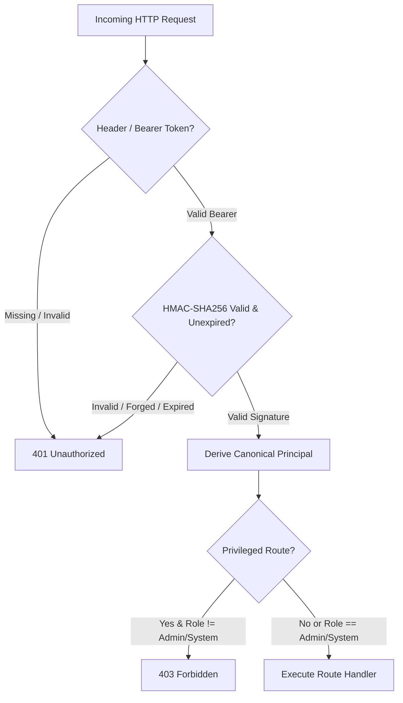

# PHASE 18 — TESTING & REGRESSION PLAN
**Project**: Finance Command Center — APEX OS  
**Project Path**: `D:\FinanceCommandCenter`  
**GitHub Repository**: `https://github.com/jar-ce/FinanceCommandCenter.git`  
**Branch**: `main`  
**Phase Status**: **PHASE 18 PLANNING COMPLETE — AWAITING IMPLEMENTATION AUTHORIZATION**  
**Execution Date**: September 25, 2026  

---

## 1. Executive Summary

Phase 18 is the dedicated **Testing & Regression Phase** for Finance Command Center — APEX OS. Following the completion and cryptographic verification of Phase 17 Security Remediation, Phase 18 establishes a comprehensive, deterministic test and regression architecture across all 18 completed phases (Phases 0–17).

The primary objective of Phase 18 is to guarantee that the APEX OS platform remains 100% functionally correct, cryptographically secure, financially invariant, and free from regression across all domain modules, API endpoints, user interface components, and database repositories.

> [!IMPORTANT]
> **Planning Stage Constraint**: This document represents the authoritative Phase 18 Planning Stage. Zero application source code, financial formulas, UI designs, database schemas, migrations, or third-party dependencies are modified during this stage.

---

## 2. Current Verified Test Baseline

The repository test baseline was empirically verified via `npm run test`, `npm run type-check`, and `npm run build`:

| Package Workspace | Test Runner / Framework | Test Files Passed | Tests Passed | Failed / Skipped | Status |
| :--- | :--- | :--- | :--- | :--- | :--- |
| **`@finance-command-center/api`** | Vitest v2.1.9 (Node.js) | 16 | 188 | 0 / 0 | **PASSED** |
| **`@finance-command-center/web`** | Vitest v2.1.9 (JSDOM / Happy-DOM) | 14 | 54 | 0 / 0 | **PASSED** |
| **`@finance-command-center/shared-types`** | TypeScript `tsc --noEmit` | N/A | N/A | 0 / 0 | **PASSED** |
| **Total Platform Baseline** | **Vitest Workspace Harness** | **30** | **242** | **0 / 0** | **100% PASSED** |

### Static Analysis & Build Verification Baseline:
- `npm run type-check`: **0 Errors** across all 3 monorepo workspaces.
- `npm run build`: **Clean Monorepo Build** (`packages/shared-types`, `apps/api`, `apps/web`).

---

## 3. Repository Test Architecture

The APEX OS testing architecture is structured around a fast, deterministic, non-flaky monorepo test harness:

1. **Backend API Harness (`apps/api/src/__tests__/`)**:
   - **Framework**: Vitest v2.1.9 running on Node.js.
   - **HTTP Test Injection**: Fastify `app.inject()` method for fast, in-memory HTTP endpoint testing without binding to network ports.
   - **Database Isolation**: PostgreSQL migration engine (`runMigrations()`) running against isolated local test database instances.
   - **Mocking Strategy**: Development provider stubs (`DevelopmentMarketDataProvider`, `DevelopmentIPOProvider`) for external API isolation.

2. **Frontend UI Harness (`apps/web/src/__tests__/`)**:
   - **Framework**: Vitest + React Testing Library + `@testing-library/user-event`.
   - **Environment**: DOM environment powered by Happy-DOM.
   - **Component Mocking**: Custom lightweight canvas and window resize mocks for UI components (`ResizableTable`, Recharts wrapper).

3. **Shared Types Package (`packages/shared-types/`)**:
   - **Validation**: TypeScript compiler (`tsc --noEmit`) verifying schema contracts and DTO interfaces across API and Frontend.

---

## 4. Subsystem Test Inventory & Map

The APEX OS platform test inventory spans 30 existing test files across 16 core subsystems:

```
apps/api/src/__tests__/
├── health.test.ts (Infrastructure Health & Readiness)
├── db-migration.test.ts (Database Schema & Migration Engine)
├── financial-precision.test.ts (PostgreSQL NUMERIC & Decimal.js Precision)
├── khata.test.ts (Digital Khata Domain & HTTP API)
├── ipo.test.ts (IPO Center Master & Sync)
├── ipo-applications.test.ts (IPO Application Tracker & Foreign Keys)
├── ipo-allotments.test.ts (IPO Allotment Checker & Verification Engine)
├── market-data.test.ts (Stock Market Data Master & Provider Stubs)
├── stock-search.test.ts (Stock Search & Instrument Details API)
├── watchlists.test.ts (Watchlist Management & User Isolation)
├── portfolios.test.ts (Portfolio Accounting & Holdings Calculations)
├── pnl.test.ts (Realized/Unrealized P&L Analytics Engine)
├── alerts.test.ts (Alert Rules, Evaluator & Notification Triggering)
├── dashboard.test.ts (Unified Command Center Dashboard Telemetry)
├── reports.test.ts (Reports & Analytics Engine)
├── repositories.test.ts (Drizzle Clean Architecture Repositories)
└── security-remediation.test.ts (SEC-01 through SEC-07 Security Controls)

apps/web/src/__tests__/
├── shell.test.tsx (Application Shell & Navigation Command Rail)
├── command-palette.test.tsx (Global Command Palette Ctrl+K)
├── resizable-table.test.tsx (ResizableTable UI Primitive)
├── khata.test.tsx (Digital Khata Workspace UI)
├── ipo.test.tsx (IPO Center Workspace UI)
├── ipo-applications.test.tsx (IPO Applications Workspace UI)
├── stock-search.test.tsx (Stock Search & Details UI)
├── watchlist.test.tsx (Watchlist Workspace UI)
├── portfolio.test.tsx (Portfolio Workspace UI)
├── pnl-ui.test.tsx (P&L Analytics Workspace UI)
├── alerts-ui.test.tsx (Alerts & Notifications Workspace UI)
├── dashboard-ui.test.tsx (Unified Dashboard Command Center UI)
└── reports-ui.test.tsx (Reports & Analytics Workspace UI)
```

---

## 5. Phase 0–17 Regression Matrix

| Phase | Subsystem | Current Test Coverage | Critical Invariants | Regression Risks | Planned Phase 18 Tests |
| :--- | :--- | :--- | :--- | :--- | :--- |
| **Phase 0-3** | Core Infra & Database | `health.test.ts`, `db-migration.test.ts`, `repositories.test.ts` | Schema migrations, DB liveness, clean repository boundaries | Broken migration rollback, orphan records | Add explicit connection pool exhaustion & transaction rollback tests |
| **Phase 4** | App Shell & Nav | `shell.test.tsx`, `command-palette.test.tsx` | Ctrl+K hotkey, route navigation, active tab highlight | Broken shortcuts, unhandled navigation errors | Add focus trap & keyboard accessibility navigation tests |
| **Phase 5** | Digital Khata | `khata.test.ts`, `khata.test.tsx` | Immutability, `MONEY_IN`/`MONEY_OUT` math, reversal balance integrity | Double reversals, negative transaction amounts | Add concurrent reversal & zero-amount rejection tests |
| **Phase 6** | IPO Center | `ipo.test.ts`, `ipo.test.tsx` | Canonical IPO master records, pipeline status filtering | Invalid status transition, malformed date filters | Add edge-case date range & invalid status enum validation tests |
| **Phase 7** | IPO Tracker | `ipo-applications.test.ts`, `ipo-applications.test.tsx` | `ON DELETE RESTRICT` on users, application status machine | User deletion cascade, duplicate application submission | Add duplicate IPO application submission protection test |
| **Phase 8** | IPO Allotments | `ipo-allotments.test.ts` | Allotment state verification, `VERIFIED` status immutability | Overwriting verified allotment result on provider failure | Add provider timeout & unverified status fallback tests |
| **Phase 9-10** | Market Data & Search | `market-data.test.ts`, `stock-search.test.ts`, `stock-search.test.tsx` | Quote freshness, search query sanitization, provider fallbacks | Stale quote rendering, search query injection | Add malformed query string & stale quote severity flag tests |
| **Phase 11** | Watchlists | `watchlists.test.ts`, `watchlist.test.tsx` | User isolation, unique instrument per watchlist constraint | Cross-user watchlist visibility, duplicate items | Add cross-user IDOR attempt & maximum items limit tests |
| **Phase 12** | Portfolios | `portfolios.test.ts`, `portfolio.test.tsx` | Weighted-average cost, BUY/SELL accounting, oversell block | Negative quantity holdings, overselling position | Add concurrent SELL transaction race condition tests |
| **Phase 13** | P&L Analytics | `pnl.test.ts`, `pnl-ui.test.tsx` | Realized vs Unrealized P&L separation, `Decimal.js` math | Floating point drift, missing quote price crash | Add missing market quote price fallback calculation tests |
| **Phase 14** | Alerts & Notifications | `alerts.test.ts`, `alerts-ui.test.tsx` | Threshold re-triggering logic, unread notification counter | Alert trigger flooding, invalid notification state | Add alert cooldown & bulk notification read tests |
| **Phase 15** | Unified Dashboard | `dashboard.test.ts`, `dashboard-ui.test.tsx` | `Promise.allSettled` subsystem isolation, summary aggregation | Partial API failure crashing entire dashboard | Add 500 error on single subsystem resilience test |
| **Phase 16** | Reports & Analytics | `reports.test.ts`, `reports-ui.test.tsx` | 7 report types, Asia/Kolkata timezone & UTC date conversion | Timezone conversion skew, unbounded report queries | Add cross-year boundary & leap-year date range tests |
| **Phase 17** | Security Controls | `security-remediation.test.ts` | SEC-01 through SEC-07, HMAC principal verification | Token forgery, identity header override, CORS bypass | Add expired JWT token & forged signature negative tests |

---

## 6. Financial Integrity Test Strategy

Finance Command Center — APEX OS enforces strict financial precision using PostgreSQL `NUMERIC(18, 4)` columns and `Decimal.js` in TypeScript.

### 6.1 Digital Khata Invariants
- **Transaction Math**: $\text{Balance} = \sum \text{MONEY\_IN} - \sum \text{MONEY\_OUT}$.
- **Immutability & Reversals**: Transactions are never hard-deleted; reversals create a balancing entry.
- **Double-Reversal Prevention**: Attempting to reverse an already-reversed transaction must throw `400 Bad Request`.
- **Validation**: Negative amounts ($0.00$) and invalid date formats are strictly rejected.

### 6.2 Portfolio & Holdings Invariants
- **BUY Transaction**: Increases position quantity; updates weighted-average cost:
  $$\text{WAC}_{\text{new}} = \frac{(\text{Qty}_{\text{old}} \times \text{WAC}_{\text{old}}) + (\text{Qty}_{\text{buy}} \times \text{Price}_{\text{buy}})}{\text{Qty}_{\text{old}} + \text{Qty}_{\text{buy}}}$$
- **SELL Transaction**: Reduces position quantity; weighted-average cost remains unchanged.
- **Oversell Prevention**: Attempting to SELL a quantity greater than current holding quantity throws `400 Bad Request`.
- **Zero/Negative Quantity Protection**: Holdings with $0$ quantity are archived/hidden from active holdings view.

### 6.3 P&L Analytics Engine Invariants
- **Realized P&L**: Computed strictly on closed/sold quantities:
  $$\text{Realized P\&L} = (\text{Price}_{\text{sell}} - \text{WAC}) \times \text{Qty}_{\text{sell}}$$
- **Unrealized P&L**: Computed on active open positions against current market quote:
  $$\text{Unrealized P\&L} = (\text{Price}_{\text{market}} - \text{WAC}) \times \text{Qty}_{\text{current}}$$
- **Stale Market Data Handling**: If market quote is marked `STALE` or unavailable, Unrealized P&L uses last known valid closing price and flags warning telemetry.

---

## 7. Security Regression Strategy (SEC-01 – SEC-07)

Phase 17 security controls are permanently protected against regression:



### Security Control Verification Matrix:
- **SEC-01 (Principal Boundary)**: Missing credentials $\rightarrow$ `401`; Forged token signature $\rightarrow$ `401`; Expired token $\rightarrow$ `401`. Caller-supplied `x-user-id` cannot override principal.
- **SEC-02 (Security Headers)**: API emits `X-Content-Type-Options: nosniff`, `X-Frame-Options: DENY`, `Referrer-Policy: strict-origin-when-cross-origin`, `Content-Security-Policy`.
- **SEC-03 (Production Secret)**: Startup fails fast if default dev secret is used in `NODE_ENV=production`.
- **SEC-04 (Market Master RBAC)**: `POST /api/v1/market/instruments` requires `admin`/`system` role. Regular user $\rightarrow$ `403`.
- **SEC-05 (Frontend Identity)**: Zero hardcoded user UUIDs in React UI components.
- **SEC-06 (CORS Whitelist)**: Requests from unauthorized web origins receive CORS error rejection.
- **SEC-07 (IPO Sync RBAC)**: `POST /api/v1/ipo/sync` requires `admin`/`system` role. Regular user $\rightarrow$ `403`.

---

## 8. Cross-User Isolation / IDOR Matrix

To prevent Insecure Direct Object References (IDOR), all private endpoints are tested against multi-tenant User A vs. User B boundaries:

| Resource Class | READ Action | CREATE Action | UPDATE Action | DELETE/REVERSE Action | Expected Security Result |
| :--- | :--- | :--- | :--- | :--- | :--- |
| **Khata Accounts** | User A GET User B Account | User A CREATE for User B | User A PATCH User B Account | User A ARCHIVE User B Account | **404 Not Found / 403 Forbidden** |
| **Khata Transactions** | User A GET User B Ledger | User A POST to User B Account | N/A (Immutable) | User A REVERSE User B Tx | **404 Not Found / 403 Forbidden** |
| **Portfolios** | User A GET User B Portfolio | User A CREATE for User B | User A PATCH User B Portfolio | User A DELETE User B Portfolio | **404 Not Found / 403 Forbidden** |
| **Holdings / Trades** | User A GET User B Holdings | User A POST SELL for User B | N/A | N/A | **404 Not Found / 403 Forbidden** |
| **IPO Applications** | User A GET User B Application | User A CREATE for User B | User A PATCH User B App | User A CANCEL User B App | **404 Not Found / 403 Forbidden** |
| **Watchlists** | User A GET User B Watchlist | User A ADD to User B Watchlist | User A PATCH User B List | User A DELETE User B Watchlist | **404 Not Found / 403 Forbidden** |
| **Alert Rules** | User A GET User B Alert Rule | User A CREATE for User B | User A TOGGLE User B Rule | User A DELETE User B Rule | **404 Not Found / 403 Forbidden** |
| **Notifications** | User A GET User B Notifications | N/A (System Generated) | User A READ User B Notif | User A ARCHIVE User B Notif | **404 Not Found / 403 Forbidden** |

---

## 9. API Contract & Endpoint Inventory Regression

The repository contains exactly **75 REST endpoints**. All 75 endpoints are audited for authentication, validation, and standardized JSON error response structure:

```json
{
  "success": false,
  "error": {
    "code": "UNAUTHORIZED | FORBIDDEN | NOT_FOUND | VALIDATION_ERROR | INTERNAL_ERROR",
    "message": "Human-readable error message without leaking sensitive internal details"
  }
}
```

---

## 10. Validation & Error Leakage Strategy

### 10.1 Input Validation Edge Cases
Zod schemas validate all incoming HTTP parameters. Regression tests enforce rejection for:
- Malformed UUID strings (`x-user-id: not-a-uuid`).
- Missing required JSON fields.
- Unexpected extra properties in request payload.
- Invalid enum values (`accountType: INVALID_TYPE`).
- Out-of-bound numeric values (negative transaction amounts, zero quantity trades).
- Malformed ISO-8601 date strings.

### 10.2 Error Sanitization & Leakage Prevention
API error handlers ensure client responses **NEVER** leak:
- Raw SQL queries or PostgreSQL table/column names.
- TypeScript/JavaScript stack traces.
- Absolute filesystem paths (`D:\FinanceCommandCenter\...`).
- Environment variables or `JWT_SECRET`.
- Database credentials or connection pool strings.

---

## 11. Provider & Market Data Resilience Strategy

Market data and IPO providers operate under strict fallback policies:

| Provider State | Market Data Behavior | IPO Provider Behavior | Financial UI Treatment |
| :--- | :--- | :--- | :--- |
| **LIVE** | Real-time quote feed active | Real-time sync active | Display live prices & badges |
| **DELAYED** | 15-min delayed quote feed | Delayed status update | Display `DELAYED` warning badge |
| **EOD** | End-of-day settlement price | EOD master status | Display `EOD` settlement badge |
| **STALE** | Cached quote > threshold age | Cached IPO record | Display `STALE` yellow alert banner |
| **UNAVAILABLE** | Provider offline / HTTP failure | Provider HTTP failure | Preserve last known valid price; display `UNAVAILABLE` banner |

---

## 12. Dashboard & Reports Regression Strategy

- **Dashboard Telemetry (`/api/v1/dashboard/summary`)**: Aggregates telemetry across Portfolios, Khata, IPOs, and Alerts using `Promise.allSettled()`. Partial subsystem failure does NOT crash the entire dashboard.
- **Reports Engine (`/api/v1/reports/*`)**: Supports 7 report views (Summary, Portfolio Performance, Asset Allocation, Realized P&L, Khata Cash Flow, IPO Participation, Alerts Analytics). Enforces Asia/Kolkata calendar semantics and UTC date conversions.

---

## 13. Frontend UI & Accessibility Regression Strategy

- **State Coverage**: React components are tested across 5 core states: Loading, Empty, Data Rendered, Partial Error, and Fatal Error.
- **Accessibility Guarantees**:
  - Focus indicators visible on interactive elements (`:focus-visible`).
  - Screen reader attributes (`aria-label`, `aria-expanded`, `role="dialog"`).
  - Keyboard navigation supported on modals and command palette (`Esc` key closure).

---

## 14. Database & Concurrency Strategy

- **Foreign Key Invariants**: `users.id` foreign keys enforce `ON DELETE RESTRICT` to prevent orphan financial records.
- **Concurrency Protections**:
  - Simultaneous SELL orders on a portfolio position cannot drive holdings negative.
  - Simultaneous Khata transaction reversals cannot cause double-counting.
  - Concurrent IPO sync triggers cannot create duplicate IPO master records.

---

## 15. Dependency Residual Risk Regression Plan

Phase 17 documented 5 critical/high dependency risks. Phase 18 provides targeted regression test coverage around package-sensitive code paths:

| Package | Severity | Advisory | Technical Regression Protection |
| :--- | :--- | :--- | :--- |
| `vitest` | CRITICAL | Vitest UI file read | Headless test execution (`vitest run`); UI server mode disabled |
| `drizzle-orm` | HIGH | Raw SQL identifier injection | Parameterized Drizzle query builder tests (`db.select()`, `db.insert()`) |
| `fastify` | HIGH | DoS / header tabs / stream leak | Zod body validation tests & host header sanitization tests |
| `find-my-way` | HIGH | HTTP/2 router DDoS | HTTP/1.1 Fastify configuration tests |
| `vite` | HIGH | Dev server path traversal | Production static build serving tests |

---

## 16. Test Execution Hierarchy & Pyramid

Phase 18 establishes a 6-level testing pyramid:

```
       [ Level 6: Full Monorepo Regression ]       <-- Pre-commit / CI
      [ Level 5: Frontend UI & Component ]        <-- Workspace: web
     [ Level 4: API Integration & HTTP ]          <-- Workspace: api
    [ Level 3: Database & Repository Tests ]      <-- Workspace: api
   [ Level 2: Domain Logic & Math Engines ]       <-- Workspace: api
  [ Level 1: Static Type Check & Linting ]        <-- Shared Types
```

---

## 17. Deterministic Test Data & Fixtures Strategy

All tests utilize deterministic test data and UUIDs to prevent non-reproducible test failures:

- **User A (Standard User)**: `00000000-0000-4000-a000-000000000001`
- **User B (Isolated User)**: `00000000-0000-4000-a000-000000000002`
- **Admin Principal**: `00000000-0000-4000-a000-000000000099` (Role: `admin`)
- **System Principal**: `00000000-0000-4000-a000-000000000088` (Role: `system`)

Zero real personal financial records, production secrets, or live API credentials are used in test fixtures.

---

## 18. File-by-File Implementation Plan

The following test suites will be created or updated during the Phase 18 Implementation Stage:

### Planned New Test Files (Phase 18 Implementation):
1. `apps/api/src/__tests__/concurrency-regression.test.ts`: Concurrent SELL & reversal race condition tests.
2. `apps/api/src/__tests__/idor-isolation.test.ts`: Systematic User A vs User B cross-user boundary tests across all 70 private endpoints.
3. `apps/api/src/__tests__/validation-edge-cases.test.ts`: Exhaustive Zod schema edge-case rejection tests.
4. `apps/web/src/__tests__/accessibility.test.tsx`: Keyboard navigation and ARIA attribute tests across UI modals.

---

## 19. Database Gate Verification

```text
Tables Added: 0
Migrations Added: 0
Schema Modified: NO
Database Gate Status: PASSED (ZERO SCHEMA MODIFICATIONS)
```

---

## 20. Phase Boundaries & Exclusions

Strictly excluded from Phase 18:
- Phase 19 Performance Optimization work.
- Phase 20 Production Preparation work.
- Live broker / trading exchange API integrations.
- AI investment recommendations or automated trading.
- PDF / CSV / Excel export implementations.
- UI redesigns or un-authorized refactoring.

---

## 21. Approval Gate & Phase Status

```text
PHASE 18 — TESTING & REGRESSION PLANNING COMPLETE
Repository Inspection: COMPLETE
Current Test Baseline: VERIFIED (30 Test Files | 242 Tests Passed)
Test Architecture Review: COMPLETE
Regression Matrix: COMPLETE
Financial Integrity Test Plan: COMPLETE
Security Regression Plan: COMPLETE
API Regression Plan: COMPLETE
Frontend Regression Plan: COMPLETE
Coverage Gap Analysis: COMPLETE
Concurrency Test Plan: COMPLETE
Dependency Regression Plan: COMPLETE
File-by-File Plan: COMPLETE
Database Gate: PASSED

Implementation: NOT STARTED
Application Code Changes: 0
Schema Changes: 0
Migrations: 0
Dependency Changes: 0

GitHub Sync: VERIFIED
GitHub Branch: main
Local == Remote: YES
Working Tree: CLEAN

Phase 19: NOT STARTED
Phase 20: NOT STARTED

STOPPED — AWAITING PHASE 18 IMPLEMENTATION AUTHORIZATION
```
