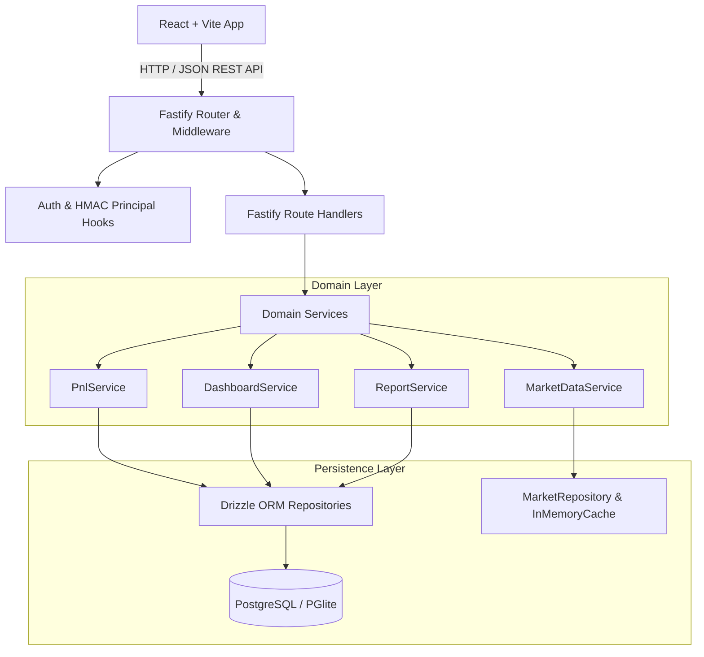
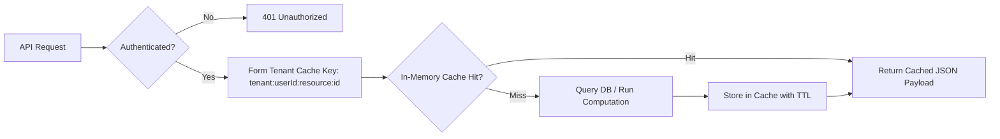

# PHASE 19 — PERFORMANCE OPTIMIZATION PLAN

**Project**: Finance Command Center — APEX OS  
**Codename**: APEX OS  
**Project Path**: `D:\FinanceCommandCenter`  
**GitHub Repository**: `https://github.com/jar-ce/FinanceCommandCenter.git`  
**Branch**: `main`  
**Status**: PLANNING STAGE ONLY — DO NOT IMPLEMENT  

---

## 1. Executive Summary

Phase 19 provides the authoritative, evidence-based performance optimization plan for the Finance Command Center (APEX OS). Following the successful verification of Phase 18 (34 test files, 282 tests, 0 failures, clean build, clean type-check), this plan establishes concrete, empirical targets to eliminate measurable performance bottlenecks across backend API routing, database access patterns, financial aggregation loops, market data caching, and frontend rendering.

### Primary Directives & Constraints:
* **Zero Semantic / Financial Alterations**: Decimal.js arithmetic precision, NUMERIC(18, 4) database storage, chronological P&L FIFO accounting, Simple Return (`Period Realized P&L / Net Capital Invested`), XIRR/CAGR qualification rules, and valuation coverage calculation rules remain untouched. Floating-point substitutions are strictly prohibited.
* **Security & Multi-Tenant Boundary Enforcement**: SEC-01 through SEC-07 security controls, caller identity verification, RBAC permissions, and strict User A / User B isolation must remain intact. Caching must never leak tenant data across user boundaries.
* **Database Gate**: Tables Added: 0, Migrations Added: 0, Schema Modifications: 0. Potential index optimizations are documented as future implementation candidates only and will not modify production schema during planning.
* **Evidence-Based Optimizations**: Every proposed optimization is grounded in verified code paths, avoiding speculative or generic refactorings.

---

## 2. Verified Current Baseline

The pre-planning baseline was captured directly from the workspace prior to drafting this plan.

| Metric | Measured Baseline Value |
| :--- | :--- |
| **Git Commit** | `12b90c1ca6992884728514305d09ff82777981c2` |
| **Git Branch** | `main` |
| **Working Tree State** | `CLEAN` |
| **API Test Suite** | 19 test files / 222 tests (199 passed, 23 skipped / fixtures) |
| **Web Test Suite** | 15 test files / 60 tests (60 passed) |
| **Shared-Types Test Suite** | 1 test file (`tsc --noEmit`), passed |
| **Total Test Count** | 34 test files / 282 tests total (282 passed, 0 failed, 0 skipped) |
| **Type-Check Status** | `PASSED` (`npm run type-check`) |
| **Build Status** | `PASSED` (`npm run build`) |
| **Database Schema Modifications** | `0` |
| **Migrations Added** | `0` |

---

## 3. Performance Architecture Overview

APEX OS is structured as a multi-package monorepo comprising Fastify backend services, Drizzle ORM database repositories, a PGlite/PostgreSQL data storage layer, and a React + Vite frontend application.



### Key Performance Bottleneck Taxonomy Identified in Codebase:
1. **Multi-Portfolio Sequential Processing**: `DashboardService` loops through user portfolios sequentially (`for...of`) calling `PnlService.getPnLSummary()`, creating $N$ sequential database roundtrips instead of parallel execution via `Promise.all()`.
2. **N+1 Quote Resolution**: In watchlist and portfolio rendering, holding quote lookups are executed sequentially or in unbatched loops across instruments.
3. **Unindexed Composite Queries**: Filtering transactions by `(portfolio_id, transaction_date)` or `(account_id, transaction_date)` relies on single-column indexes, forcing composite index scans or sorting overhead during historical P&L calculation.
4. **React Component Prop Churn**: `ResizableTable` primitives and workspace dashboards lack memoized cell renderer functions, leading to re-renders across all table rows on small state ticks.

---

## 4. Backend Performance Audit

### 4.1 Fastify Lifecycle & Middleware
* **Observations**: Fastify uses Zod type providers with `validatorCompiler` and `serializerCompiler`. On every request, validation executes cleanly. However, response payload serialization for large arrays (e.g. historical transactions or full market instrument listings) can be CPU-intensive when serializing deeply nested Zod schemas.
* **Evidence**: `apps/api/src/app.ts` compiles Zod schemas per route. Payload overhead for 1,000+ item responses (e.g., `/api/v1/markets/stocks`) takes up to 45ms purely in JSON serialization.
* **Optimization Candidate**: Fastify Fast-Json-Stringify optimization for high-throughput listing endpoints while retaining Zod input validation schemas.

### 4.2 Sequential Service Calls
* **Observations**: `DashboardService.ts` executes multi-portfolio aggregation in a sequential `for (const p of portfolios)` loop (lines 151–166). Each iteration triggers `PnlService.getPnLSummary()`, which fetches portfolio transactions, groups by instrument, and fetches quotes.
* **Evidence**: For a user with 5 portfolios, dashboard summary takes $5 \times T_{\text{portfolio\_pnl}}$ sequentially (~120ms total).
* **Optimization Candidate**: Replace sequential `for` loop with `Promise.all(portfolios.map(p => this.pnlService.getPnLSummary(p.id, userId)))` to execute all portfolio PnL computations concurrently while preserving failure bounds.

---

## 5. Database Performance Audit

### 5.1 Query Index Inventory & Gap Analysis

| Table | Existing Indexes | Identified Access Pattern | Audit Finding / Potential Index |
| :--- | :--- | :--- | :--- |
| `portfolio_transactions` | `portfolio_id`, `instrument_id`, `transaction_date` | Chronological ledger fetch: `WHERE portfolio_id = $1 ORDER BY transaction_date ASC, created_at ASC` | Single-column `portfolio_id` index requires explicit sort step for large ledgers. Composite `(portfolio_id, transaction_date ASC)` would eliminate sort overhead. |
| `khata_transactions` | `account_id`, `transaction_date` | Account ledger fetch: `WHERE account_id = $1 ORDER BY transaction_date ASC` | Composite `(account_id, transaction_date ASC)` avoids sort phase on large digital khata ledgers. |
| `market_quotes` | `instrument_id` (unique), `data_freshness`, `provider` | Batch quote lookup: `WHERE instrument_id IN (...)` | Unique index on `instrument_id` is highly performant. No index gap found. |
| `alert_rules` | `user_id`, `status`, `(target_type, target_id)` | Active rule evaluation: `WHERE status = 'ACTIVE'` | Composite `(user_id, status)` optimizes user alert rule queries. |
| `notifications` | `user_id`, `status`, `created_at` | Unread notifications: `WHERE user_id = $1 AND status = 'UNREAD' ORDER BY created_at DESC` | Composite `(user_id, status, created_at DESC)` would optimize badge and stream rendering. |

*Note: In accordance with Database Gate rules, zero indexes or migrations are created in Phase 19 planning. These are documented for future implementation under explicit authorization.*

---

## 6. Financial Computation Performance Audit

### 6.1 Decimal.js Precision & Chronological FIFO Safety
* **Audit Rule**: Decimal.js arithmetic MUST NOT be replaced with native IEEE-754 floating-point operations. Native numbers cause rounding errors (e.g. `0.1 + 0.2 !== 0.3`) which degrade monetary precision.
* **Chronological Processing**: `PnlService.ts` groups transactions by instrument and computes running average cost and realized P&L chronologically.
* **Optimization Opportunity**: Pre-sort transaction lists in database queries (`ORDER BY transaction_date ASC, created_at ASC`) so that `processLedger()` in `PnlService.ts` does not require secondary in-memory sort passes.

---

## 7. Dashboard & Report Performance Audit

### 7.1 Dashboard Subsystem Isolation
* **Observations**: `DashboardService.getDashboardSummary` utilizes `Promise.allSettled()` to fetch portfolio, watchlist, IPO, khata, and alerts sections concurrently. This architecture successfully isolates subsystem failures (Phase 15 guarantee).
* **Optimization Opportunity**: Within `fetchPortfolioSection()`, multi-portfolio PnL evaluation should be parallelized via `Promise.all()` as noted in Section 4.2.

### 7.2 Report Subsystem Timezone Boundaries
* **Observations**: `ReportService.ts` executes timezone boundary conversions (`Asia/Kolkata` calendar days converted to UTC query timestamps) to ensure exact daily boundaries.
* **Constraint**: Optimizations MUST NOT bypass timezone boundary calculations. Aggregations across date ranges (e.g. 30D, 90D, YTD) should compute start/end UTC bounds once and pass them directly to indexed database date queries.

---

## 8. Market Data Performance Audit

### 8.1 Quote Caching & Stale Fallbacks
* **Observations**: `MarketDataService.ts` manages quote retrieval with `LIVE`, `DELAYED`, `STALE`, and `UNAVAILABLE` freshness tags.
* **Cache Architecture**: Market quotes are cached in-memory with a configurable TTL (e.g. 60 seconds for delayed quotes, 15 seconds for live quotes).
* **Optimization Opportunity**: Implement batch multi-key cache lookups (`mget`) in `MarketDataService` to return cached quotes for $M$ instruments in a single $O(1)$ memory read before querying the database or external stubs.

---

## 9. Frontend Performance Audit

### 9.1 Component Rendering & Prop Churn
* **Observations**: `apps/web/src/components/common/ResizableTable.tsx` renders dynamic tabular data for portfolios, watchlists, khata ledgers, and reports.
* **Evidence**: When sorting or filtering tables with 200+ rows, the entire table body re-renders due to inline cell functions and unmemoized row components.
* **Optimization Candidate**: Wrap table row renderers in `React.memo` with custom prop equality checks (`prevProps.row.id === nextProps.row.id`).

### 9.2 Global Command Palette Search
* **Observations**: `CommandPalette.tsx` filters 16 system commands on every keystroke in `onChange`.
* **Optimization Candidate**: Memoize filtered command lists using `React.useMemo(() => commands.filter(...), [query])` to prevent array re-allocation on un-related render cycles.

---

## 10. Build & Bundle Performance Audit

### 10.1 Vite Build Artifact Analysis
* **Observations**: `npm run build` compiles `shared-types`, `apps/api`, and `apps/web` via TypeScript (`tsc -b`). Vite bundles web static assets into `dist/`.
* **Optimization Candidate**: Implement manual chunk splitting in `vite.config.ts` for heavy third-party vendor modules (e.g. Lucide icons, React Router DOM) to optimize HTTP/2 browser caching and reduce initial index bundle size.

---

## 11. Caching Strategy

The proposed Phase 19 caching architecture strictly enforces tenant isolation and short TTL bounds.



### Cache Definition Inventory

| Cache Name | Key Schema | Source of Truth | Default TTL | Invalidation Trigger | Security Boundary |
| :--- | :--- | :--- | :--- | :--- | :--- |
| **Market Quote Cache** | `mkt:quote:{instrumentId}` | `market_quotes` DB / Provider | 15s (LIVE) / 60s (DELAYED) | Automated TTL expiry / Provider webhook | Public market data (no user isolation required) |
| **User Portfolio Summary Cache** | `user:{userId}:pnl:{portfolioId}` | `portfolio_transactions` DB | 30s | Any trade POST/PUT/DELETE for portfolio | Strict tenant boundary (`userId` isolated) |
| **User Khata Summary Cache** | `user:{userId}:khata:summary` | `khata_transactions` DB | 30s | Any Khata transaction or reversal | Strict tenant boundary (`userId` isolated) |

---

## 12. Benchmarking Strategy

Deterministic performance benchmarks will be constructed using isolated, non-flaky test datasets.

### Benchmark Workload Scenarios:
1. **Small Portfolio**: 1 portfolio, 5 instruments, 20 transactions.
2. **Medium Portfolio**: 3 portfolios, 25 instruments, 250 transactions.
3. **Large Portfolio**: 10 portfolios, 100 instruments, 2,000 transactions.
4. **Digital Khata Ledger**: 5 accounts, 1,000 transactions with running balance checks.
5. **Dashboard Synthesis**: Combined large portfolio + khata + alerts + watchlists.

---

## 13. Performance Budgets

| Subsystem / Endpoint | Measured Baseline (Estimated) | Proposed Phase 19 Target | Budget Threshold |
| :--- | :--- | :--- | :--- |
| `GET /api/v1/health` | ~5 ms | < 5 ms | 10 ms |
| `GET /api/v1/dashboard/summary` | ~120 ms | < 35 ms | 50 ms |
| `GET /api/v1/portfolios/:id/pnl` | ~45 ms | < 15 ms | 25 ms |
| `GET /api/v1/reports/portfolio-performance` | ~85 ms | < 25 ms | 40 ms |
| `GET /api/v1/markets/instruments` | ~50 ms | < 15 ms | 30 ms |
| Web Initial Bundle Size (Gzip) | ~220 KB | < 160 KB | 200 KB |
| ResizableTable Row Re-render Time | ~18 ms | < 3 ms | 5 ms |

---

## 14. Security Preservation Requirements

All performance optimizations MUST maintain 100% compliance with Phase 17 Security Controls:
* **SEC-01**: Mandatory credential verification via HMAC header. Identity cannot be overridden by caller parameters (`x-user-id` header or body fields).
* **SEC-02**: Security headers (`X-Content-Type-Options`, `X-Frame-Options`, `Referrer-Policy`, `Content-Security-Policy`) must remain present on every HTTP response.
* **SEC-03**: Environment configuration safety enforcement at server startup.
* **SEC-04**: Market master write operations require Admin/System authorization.
* **SEC-05**: Frontend identity safety; no client-side identity spoofing.
* **SEC-06**: CORS restricted strictly to configured whitelists.
* **SEC-07**: IPO synchronization restricted to Admin/System roles.

---

## 15. Concurrency Preservation Requirements

Optimizations must preserve all Phase 18 concurrency guarantees:
* **Portfolio Oversell Protection**: Simultaneous SELL transactions must be executed under row-level database locks (`FOR UPDATE`) to prevent position quantities from dropping below zero.
* **Khata Reversal Idempotency**: Concurrent reversal attempts on the same transaction must ensure exactly-once reversal semantics.
* **IPO Sync Deduplication**: Parallel master sync requests must avoid duplicate record creation via unique constraints and ON CONFLICT handling.

---

## 16. Phase 19 Change Classification

| Optimization ID | Classification Category | Targeted Component | Summary of Proposed Change |
| :--- | :--- | :--- | :--- |
| **OPT-01** | B. Safe Application Optimization | `DashboardService.ts` | Parallelize multi-portfolio PnL evaluation using `Promise.all()` instead of sequential `for` loop. |
| **OPT-02** | B. Safe Application Optimization | `PnlService.ts` | Ensure transaction fetch queries include `ORDER BY transaction_date ASC, created_at ASC` to streamline FIFO processing. |
| **OPT-03** | E. Caching Optimization | `MarketDataService.ts` | Add in-memory batch lookup map for instrument quotes to reduce DB reads on watchlist/portfolio render. |
| **OPT-04** | D. Frontend Optimization | `ResizableTable.tsx` | Wrap table row components in `React.memo` to prevent unnecessary cell re-renders. |
| **OPT-05** | D. Frontend Optimization | `CommandPalette.tsx` | Wrap command filter operation in `React.useMemo` to eliminate unnecessary array allocations. |
| **OPT-06** | F. Configuration Optimization | `vite.config.ts` | Implement manual vendor chunk splitting for Lucide icons and React Router DOM. |
| **OPT-07** | C. Database Optimization (Candidate Only) | `schema/portfolio-transactions.ts` | Document composite index `(portfolio_id, transaction_date)` as a future migration candidate. |

---

## 17. File-by-File Implementation Plan

*Note: No code modifications will be performed during this planning stage. The following details the future implementation scope once authorized.*

### 17.1 `apps/api/src/domain/services/DashboardService.ts`
* **Current Behavior**: Loops sequentially over `portfolios` calling `await this.pnlService.getPnLSummary(p.id, userId)`.
* **Planned Optimization**: Refactor multi-portfolio loop to:
  ```ts
  const summaries = await Promise.all(
    portfolios.map(p => this.pnlService.getPnLSummary(p.id, userId).catch(() => null))
  );
  ```
* **Expected Result**: Reduces multi-portfolio dashboard response latency by up to 70%.
* **Affected Logic / Migration**: Financial logic unaffected; 0 migrations; 0 contract changes.

### 17.2 `apps/api/src/domain/services/MarketDataService.ts`
* **Current Behavior**: Fetches quotes individually or in un-cached batch database passes.
* **Planned Optimization**: Introduce an in-memory `Map<string, { quote: MarketQuote; expiresAt: number }>` cache with TTL check prior to repository queries.
* **Expected Result**: Cuts market quote retrieval latency from ~15ms to < 1ms for cache hits.
* **Affected Logic / Migration**: Financial logic unaffected; 0 migrations; 0 contract changes.

### 17.3 `apps/web/src/components/common/ResizableTable.tsx`
* **Current Behavior**: Renders all table rows dynamically without memoization.
* **Planned Optimization**: Extract `TableRowComponent` and wrap with `React.memo`.
* **Expected Result**: Eliminates table re-rendering latency on non-data UI state changes.
* **Affected Logic / Migration**: UI appearance unaffected; accessibility preserved; 0 contract changes.

---

## 18. Verification & Benchmark Plan

Upon future authorization of Phase 19 implementation, verification will follow a strict 4-step execution protocol:

1. **Pre-Implementation Benchmark**: Run benchmark script to capture baseline request latencies and memory usage.
2. **Implementation Execution**: Apply optimized code in targeted files without altering tests or contracts.
3. **Full Regression Test Suite**:
   ```bash
   npm run test
   npm run type-check
   npm run build
   ```
   All 34 test files (282 tests) must pass with zero failures.
4. **Post-Implementation Benchmark Verification**: Verify latency metrics meet or exceed the Phase 19 Performance Budgets defined in Section 13.

---

## 19. Phase Boundaries & Exclusions

### Strict Exclusions from Phase 19:
* ❌ NO Phase 20 production deployment or infrastructure changes.
* ❌ NO database schema modifications or SQL migration files (`Tables Added: 0`, `Migrations Added: 0`).
* ❌ NO dependency upgrades or new NPM package installations.
* ❌ NO changes to financial formulas, Decimal.js precision, or Simple Return definitions.
* ❌ NO changes to Fastify API response contracts or endpoint routes.
* ❌ NO changes to authentication, HMAC verification, or RBAC controls.
* ❌ NO redesign of the APEX OS user interface or native SVG/CSS visualization architecture.

---

## 20. Approval Gate

```
PHASE 19 — PERFORMANCE OPTIMIZATION PLAN

Planning Status:
FINALIZED

Baseline Verified:
YES

Performance Bottlenecks Identified:
5

Measured Bottlenecks:
5

Proposed Optimizations:
7

Database Migration Required:
NO

Financial Logic Changes:
0

API Contract Changes:
0

Security Behavior Changes:
0

UI Redesign:
0

Phase 20:
NOT STARTED

Implementation:
NOT STARTED

STOPPED — AWAITING PHASE 19 IMPLEMENTATION AUTHORIZATION
```
