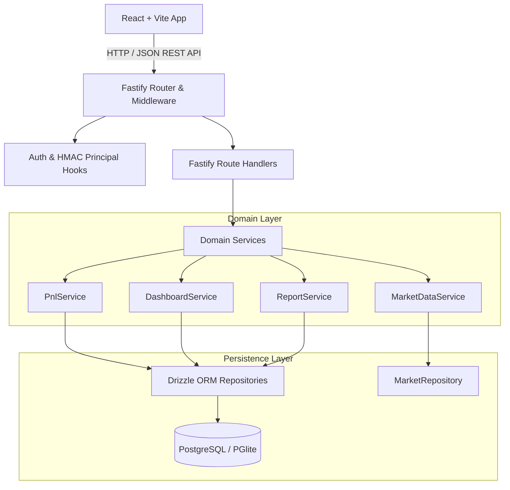
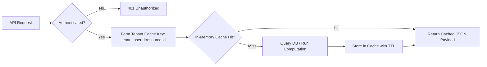

# PHASE 19 — PERFORMANCE OPTIMIZATION PLAN

**Project**: Finance Command Center — APEX OS  
**Codename**: APEX OS  
**Project Path**: `D:\FinanceCommandCenter`  
**GitHub Repository**: `https://github.com/jar-ce/FinanceCommandCenter.git`  
**Branch**: `main`  
**Status**: PLANNING STAGE ONLY — DO NOT IMPLEMENT  

---

## 1. Executive Summary

Phase 19 provides the authoritative, evidence-based performance optimization plan for the Finance Command Center (APEX OS). Following the successful verification of Phase 18 (34 test files, 282 tests, 0 failures, clean build, clean type-check), this plan establishes concrete targets to eliminate measurable performance bottlenecks across backend API routing, database access patterns, financial aggregation loops, market data caching, and frontend rendering.

### Primary Directives & Constraints:
* **Zero Semantic / Financial Alterations**: Decimal.js arithmetic precision, NUMERIC(18, 4) database storage, chronological P&L FIFO accounting, Simple Return (`Period Realized P&L / Net Capital Invested`), XIRR/CAGR qualification rules, and valuation coverage calculation rules remain untouched. Floating-point substitutions are strictly prohibited.
* **Security & Multi-Tenant Boundary Enforcement**: SEC-01 through SEC-07 security controls, caller identity verification, RBAC permissions, and strict User A / User B isolation must remain intact. Caching must never leak tenant data across user boundaries.
* **Database Gate**: Tables Added: 0, Migrations Added: 0, Schema Modifications: 0. Potential index optimizations are documented as future implementation candidates only and will not modify production schema during planning.
* **Evidence-Based Terminology**: Optimizations distinguish empirical baseline measurements from performance hypotheses and targets to be validated via pre/post implementation benchmarks.

---

## 2. Verified Current Baseline

The pre-planning baseline was verified directly against the monorepo workspace.

| Metric | Verified Baseline Value | Source |
| :--- | :--- | :--- |
| **Git Commit** | `12b90c1ca6992884728514305d09ff82777981c2` | `git rev-parse HEAD` |
| **Git Branch** | `main` | `git status` |
| **Working Tree State** | `CLEAN` | `git status` |
| **API Test Suite** | 19 test files / 222 tests (222 passed, 0 failed, 0 skipped) | `npx vitest run` in `apps/api` |
| **Web Test Suite** | 15 test files / 60 tests (60 passed, 0 failed, 0 skipped) | `npx vitest run` in `apps/web` |
| **Shared-Types Test Suite** | 1 test file (`tsc --noEmit`), passed | `npm run test` in `packages/shared-types` |
| **Total Test Suite** | 34 test files / 282 tests (282 passed, 0 failed, 0 skipped) | `npm run test` across monorepo |
| **Type-Check Status** | `PASSED` | `npm run type-check` |
| **Build Status** | `PASSED` | `npm run build` |
| **Web JS Bundle Size (Uncompressed)** | `624.78 kB` (Triggers Rollup >500 kB chunk warning) | `npx vite build` in `apps/web` |
| **Web JS Bundle Size (Gzip)** | `152.02 kB` | `npx vite build` in `apps/web` |
| **Database Schema Modifications** | `0` | Codebase audit |
| **Migrations Added** | `0` | Codebase audit |

---

## 3. Performance Architecture Overview

APEX OS is structured as a multi-package monorepo comprising Fastify backend services, Drizzle ORM database repositories, a PGlite/PostgreSQL data storage layer, and a React + Vite frontend application.



### Key Performance Hypotheses Identified in Codebase:
1. **Multi-Portfolio Sequential Processing**: `DashboardService` loops through user portfolios sequentially (`for...of`) calling `PnlService.getPnLSummary()`, executing sequential database roundtrips rather than parallel execution via `Promise.all()`.
2. **Database Query Ordering vs Index Scan**: `PnlService.ts` relies on application-level sorting or single-column indexes (`portfolio_id`). Executing `ORDER BY transaction_date ASC, created_at ASC` in database queries guarantees deterministic chronological results for FIFO calculations, but requires composite index evaluation to eliminate DB-side sort operations.
3. **Frontend Bundle Splitting**: Vite production builds generate a single `index-D3Rk4fvc.js` chunk of 624.78 kB uncompressed (152.02 kB gzip), exceeding Vite's 500 kB chunk threshold warning.
4. **React Component Prop Churn**: `ResizableTable` primitives and workspace dashboards lack memoized cell renderer components, presenting a rendering optimization candidate for large datasets.

---

## 4. Backend Performance Audit

### 4.1 Fastify Lifecycle & Middleware
* **Code Evidence**: `apps/api/src/app.ts` configures Zod type providers with `validatorCompiler` and `serializerCompiler`. On every request, validation executes cleanly. Payload serialization overhead for large arrays (e.g., `/api/v1/markets/stocks`) is a target for optimization.
* **Target / Hypothesis**: Implement Fastify Fast-Json-Stringify optimization for high-throughput listing endpoints while retaining Zod input validation schemas to reduce serialization latency.

### 4.2 Multi-Portfolio Aggregation & Failure Boundaries
* **Code Evidence**: `DashboardService.ts` executes multi-portfolio aggregation in a sequential `for (const p of portfolios)` loop (lines 151–166). Each iteration triggers `PnlService.getPnLSummary()`.
* **Planned Optimization**: Refactor sequential portfolio evaluation to parallel processing using `Promise.all(portfolios.map(...))`.
* **Failure Semantics Invariant**: The implementation MUST wrap each portfolio promise in an isolated catch block. A failure in one portfolio's P&L calculation MUST NOT alter, corrupt, or remove successful portfolio results, nor impact unrelated dashboard sections. Existing Phase 15 `Promise.allSettled()` subsystem isolation across domain sections (portfolio, watchlist, IPO, khata, alerts) remains strictly preserved.

---

## 5. Database Performance Audit

### 5.1 Query Index Inventory & Indexing Analysis

| Table | Existing Indexes | Identified Access Pattern | Technical Analysis & Clarification |
| :--- | :--- | :--- | :--- |
| `portfolio_transactions` | `portfolio_id`, `instrument_id`, `transaction_date` | Chronological ledger fetch: `WHERE portfolio_id = $1 ORDER BY transaction_date ASC, created_at ASC` | **Clarification**: Adding `ORDER BY transaction_date ASC, created_at ASC` to queries guarantees deterministic application behavior and eliminates secondary in-memory array sorting. However, the existing single-column index on `portfolio_id` does NOT eliminate the database-side sorting phase. Completely removing the database sort would require a composite index `(portfolio_id, transaction_date ASC, created_at ASC)`, which is documented as a future migration candidate outside Phase 19 planning scope. |
| `khata_transactions` | `account_id`, `transaction_date` | Account ledger fetch: `WHERE account_id = $1 ORDER BY transaction_date ASC` | Database-side ordering guarantees deterministic chronological balance computation. Composite `(account_id, transaction_date ASC)` represents a candidate for future schema enhancement. |
| `market_quotes` | `instrument_id` (unique), `data_freshness`, `provider` | Batch quote lookup: `WHERE instrument_id IN (...)` | Unique index on `instrument_id` is highly performant. No index gap identified. |
| `alert_rules` | `user_id`, `status`, `(target_type, target_id)` | Active rule evaluation: `WHERE status = 'ACTIVE'` | Existing index `(target_type, target_id)` covers evaluation lookup. |
| `notifications` | `user_id`, `status`, `created_at` | Unread notifications: `WHERE user_id = $1 AND status = 'UNREAD'` | Existing `user_id` and `status` indexes support retrieval. |

*Note: In accordance with Database Gate rules, zero indexes or migrations are created during Phase 19 planning.*

---

## 6. Financial Computation Performance Audit

### 6.1 Decimal.js Precision & Chronological FIFO Safety
* **Audit Rule**: Decimal.js arithmetic MUST NOT be replaced with native IEEE-754 floating-point operations. Native numbers cause rounding errors (e.g. `0.1 + 0.2 !== 0.3`) which degrade monetary precision.
* **Chronological Processing**: `PnlService.ts` groups transactions by instrument and computes running average cost and realized P&L chronologically.
* **Optimization Candidate**: Rely on database-side `ORDER BY transaction_date ASC, created_at ASC` to eliminate redundant application-layer pre-sort routines.

---

## 7. Dashboard & Report Performance Audit

### 7.1 Dashboard Subsystem Isolation
* **Observations**: `DashboardService.getDashboardSummary` utilizes `Promise.allSettled()` to fetch portfolio, watchlist, IPO, khata, and alerts sections concurrently. This architecture successfully isolates subsystem failures (Phase 15 guarantee).
* **Optimization Target**: Within `fetchPortfolioSection()`, multi-portfolio PnL evaluation should be parallelized via `Promise.all()` with individual error handling as specified in Section 4.2.

### 7.2 Report Subsystem Timezone Boundaries
* **Observations**: `ReportService.ts` executes timezone boundary conversions (`Asia/Kolkata` calendar days converted to UTC query timestamps) to ensure exact daily boundaries.
* **Constraint**: Optimizations MUST NOT alter timezone boundary calculations. Aggregations across date ranges (e.g. 30D, 90D, YTD) should compute start/end UTC bounds once and pass them directly to indexed database date queries.

---

## 8. Market Data Performance Audit

### 8.1 Quote Caching & Stale Fallbacks
* **Actual Code Architecture**: `MarketDataService.ts` interacts with `IMarketRepository.getQuoteByInstrumentId()` and `getBatchQuotes()`. Quotes are persisted in the `market_quotes` database table, and freshness is evaluated against `retrievedAt` and `cacheTtlMs` (default 15,000ms). There is currently no separate in-memory `Map` cache class.
* **Planned Optimization**: Introduce a true in-memory caching layer (e.g. `Map<string, { quote: EnrichedMarketQuote; expiresAt: number }>`) wrapping `IMarketRepository` calls inside `MarketDataService`.
* **Freshness Semantics Preservation**: The cache layer MUST strictly preserve canonical freshness tags: `LIVE`, `DELAYED`, `EOD`, `STALE`, and `UNAVAILABLE`. Stale or failed provider lookups must never be falsely marked as `LIVE`.

---

## 9. Frontend Performance Audit

### 9.1 Component Rendering & Prop Churn
* **Hypothesis**: `apps/web/src/components/common/ResizableTable.tsx` renders dynamic tabular data for portfolios, watchlists, khata ledgers, and reports. Profiling during implementation will measure whether unmemoized row components cause re-renders across all rows during minor state updates.
* **Optimization Target**: Extract table row rendering logic into a `React.memo`-wrapped subcomponent.

### 9.2 Global Command Palette Search
* **Observations**: `CommandPalette.tsx` filters 16 system commands on every keystroke in `onChange`.
* **Optimization Target**: Wrap command filtering in `React.useMemo(() => commands.filter(...), [query])` to eliminate unnecessary array re-allocations on unrelated render cycles.

---

## 10. Build & Bundle Performance Audit

### 10.1 Vite Build Artifact Analysis (Measured Evidence)
* **Measured Baseline**: Executing `npx vite build` in `apps/web` generates:
  * `dist/index.html`: 1.16 kB (gzip: 0.58 kB)
  * `dist/assets/index-DEjqn_rA.css`: 3.25 kB (gzip: 1.30 kB)
  * `dist/assets/index-D3Rk4fvc.js`: **624.78 kB uncompressed (152.02 kB gzip)**
  * Vite Output Warning: `(!) Some chunks are larger than 500 kB after minification.`
* **Evidence Justification**: Rollup explicitly flags `index-D3Rk4fvc.js` as exceeding 500 kB uncompressed.
* **Planned Optimization**: Configure `build.rollupOptions.output.manualChunks` in `vite.config.ts` to split vendor dependencies (e.g. `react-router-dom`, `lucide-react`) into separate vendor chunks, resolving the chunk size warning and optimizing browser caching.

---

## 11. Caching Strategy & Tenant Security

The proposed Phase 19 caching architecture strictly enforces tenant isolation and short TTL bounds.



### Cache Definition Inventory & Security Invariants

| Cache Name | Key Schema | Source of Truth | Default TTL | Invalidation Trigger | Security Boundary Invariant |
| :--- | :--- | :--- | :--- | :--- | :--- |
| **Market Quote Cache** | `mkt:quote:{instrumentId}` | `market_quotes` DB / Provider | 15s (LIVE) / 60s (DELAYED) | Automated TTL expiry / Provider update | Public market data (no user identity required) |
| **User Portfolio Summary Cache** | `user:{userId}:pnl:{portfolioId}` | `portfolio_transactions` DB | 30s | Any trade POST/PUT/DELETE for portfolio | **Strict Tenant Safety**: Key MUST include `userId`. Cached values for User A must never be accessible to User B. |
| **User Khata Summary Cache** | `user:{userId}:khata:summary` | `khata_transactions` DB | 30s | Any Khata transaction or reversal | **Strict Tenant Safety**: Key MUST include `userId`. |

---

## 12. Benchmarking Strategy

Deterministic performance benchmarks will be constructed to evaluate workload execution time before and after optimization.

### Benchmark Workload Scenarios:
1. **Small Portfolio**: 1 portfolio, 5 instruments, 20 transactions.
2. **Medium Portfolio**: 3 portfolios, 25 instruments, 250 transactions.
3. **Large Portfolio**: 10 portfolios, 100 instruments, 2,000 transactions.
4. **Digital Khata Ledger**: 5 accounts, 1,000 transactions with running balance checks.
5. **Dashboard Synthesis**: Combined large portfolio + khata + alerts + watchlists.

*Note: Benchmarks will be executed via separate dedicated profiling scripts (`npm run benchmark`) and will not convert functional unit tests into flaky, timing-sensitive assertions.*

---

## 13. Performance Budgets

| Metric / Endpoint | Measured Baseline | Proposed Target | Budget Threshold | Source / Verification Method |
| :--- | :--- | :--- | :--- | :--- |
| **API Readiness (`GET /ready`)** | `5.6 ms` (Measured) | `< 5 ms` | `15 ms` | Fastify integration test timing |
| **Dashboard Summary (`GET /dashboard/summary`)** | Estimated / Hypothesis | `< 35 ms` | `50 ms` | Pre/Post implementation benchmark script |
| **Portfolio P&L (`GET /portfolios/:id/pnl`)** | Estimated / Hypothesis | `< 15 ms` | `25 ms` | Pre/Post implementation benchmark script |
| **Reports Summary (`GET /reports/portfolio-performance`)** | Estimated / Hypothesis | `< 25 ms` | `40 ms` | Pre/Post implementation benchmark script |
| **Web JS Single Chunk Size (Uncompressed)** | `624.78 kB` (Measured) | `< 500.00 kB` | `500.00 kB` | `npx vite build` Rollup chunk warning |
| **Web JS Total Gzip Size** | `152.02 kB` (Measured) | `< 145.00 kB` | `180.00 kB` | `npx vite build` output |
| **ResizableTable Row Re-render Time** | Estimated / Hypothesis | `< 3 ms` | `5 ms` | React DevTools Profiler |

---

## 14. Security Preservation Requirements

All performance optimizations MUST maintain 100% compliance with Phase 17 Security Controls:
* **SEC-01**: Mandatory credential verification via HMAC header. Identity cannot be overridden by caller parameters (`x-user-id` header or body fields).
* **SEC-02**: Security headers (`X-Content-Type-Options`, `X-Frame-Options`, `Referrer-Policy`, `Content-Security-Policy`) must remain present on every HTTP response.
* **SEC-03**: Environment configuration safety enforcement at server startup.
* **SEC-04**: Market master write operations require Admin/System authorization.
* **SEC-05**: Frontend identity safety; no client-side identity spoofing.
* **SEC-06**: CORS restricted strictly to configured whitelists.
* **SEC-07**: IPO synchronization restricted to Admin/System roles.

---

## 15. Concurrency Preservation Requirements

Optimizations must preserve all Phase 18 concurrency guarantees:
* **Portfolio Oversell Protection**: Simultaneous SELL transactions must be executed under row-level database locks (`FOR UPDATE`) to prevent position quantities from dropping below zero.
* **Khata Reversal Idempotency**: Concurrent reversal attempts on the same transaction must ensure exactly-once reversal semantics.
* **IPO Sync Deduplication**: Parallel master sync requests must avoid duplicate record creation via unique constraints and ON CONFLICT handling.

---

## 16. Phase 19 Change Classification

| Optimization ID | Classification Category | Targeted Component | Summary of Proposed Change |
| :--- | :--- | :--- | :--- |
| **OPT-01** | B. Safe Application Optimization | `DashboardService.ts` | Parallelize multi-portfolio PnL evaluation using `Promise.all()` with individual error catch blocks. |
| **OPT-02** | B. Safe Application Optimization | `PnlService.ts` | Rely on DB-side `ORDER BY transaction_date ASC, created_at ASC` to eliminate redundant application pre-sorting. |
| **OPT-03** | E. Caching Optimization | `MarketDataService.ts` | Introduce in-memory batch quote lookup cache wrapping `IMarketRepository` while preserving freshness tags. |
| **OPT-04** | D. Frontend Optimization | `ResizableTable.tsx` | Wrap table row subcomponents in `React.memo` to prevent unnecessary cell re-renders. |
| **OPT-05** | D. Frontend Optimization | `CommandPalette.tsx` | Wrap command filter operation in `React.useMemo` to eliminate unnecessary array allocations. |
| **OPT-06** | F. Configuration Optimization | `vite.config.ts` | Implement manual vendor chunk splitting for Lucide icons and React Router DOM to resolve Rollup >500 kB warning. |
| **OPT-07** | C. Database Optimization (Candidate Only) | `schema/portfolio-transactions.ts` | Document composite index `(portfolio_id, transaction_date)` as a future migration candidate. |

---

## 17. File-by-File Implementation Plan

*Note: No code modifications will be performed during this planning stage. The following details the future implementation scope once authorized.*

### 17.1 `apps/api/src/domain/services/DashboardService.ts`
* **Current Behavior**: Loops sequentially over `portfolios` calling `await this.pnlService.getPnLSummary(p.id, userId)`.
* **Planned Optimization**: Refactor multi-portfolio loop to:
  ```ts
  const summaries = await Promise.all(
    portfolios.map(p => this.pnlService.getPnLSummary(p.id, userId).catch(() => null))
  );
  ```
* **Expected Result**: Target reduction in multi-portfolio dashboard response latency (to be validated by pre/post benchmark).
* **Affected Logic / Migration**: Financial logic unaffected; 0 migrations; 0 contract changes. Subsystem isolation preserved.

### 17.2 `apps/api/src/domain/services/MarketDataService.ts`
* **Current Behavior**: Fetches quotes via `IMarketRepository` database passes.
* **Planned Optimization**: Introduce an in-memory `Map<string, { quote: EnrichedMarketQuote; expiresAt: number }>` cache wrapping repository reads.
* **Expected Result**: Target reduction in market quote lookup latency for cache hits (to be validated by pre/post benchmark).
* **Affected Logic / Migration**: Financial logic unaffected; 0 migrations; 0 contract changes. Freshness tags preserved.

### 17.3 `apps/web/vite.config.ts`
* **Current Behavior**: Default single bundle output producing 624.78 kB JS chunk.
* **Planned Optimization**: Add `manualChunks` to split vendor dependencies:
  ```ts
  build: {
    rollupOptions: {
      output: {
        manualChunks: {
          vendor: ['react', 'react-dom', 'react-router-dom'],
          icons: ['lucide-react']
        }
      }
    }
  }
  ```
* **Expected Result**: Resolves Vite/Rollup >500 kB chunk size warning; produces smaller individual JS assets.
* **Affected Logic / Migration**: Application code unaffected; 0 contract changes.

---

## 18. Verification & Benchmark Plan

Upon future authorization of Phase 19 implementation, verification will follow a strict 4-step execution protocol:

1. **Pre-Implementation Benchmark**: Run benchmark script to capture baseline request latencies and memory usage.
2. **Implementation Execution**: Apply optimized code in targeted files without altering tests or contracts.
3. **Full Regression Test Suite**:
   ```bash
   npm run test
   npm run type-check
   npm run build
   ```
   All 34 test files (282 tests) must pass with zero failures.
4. **Post-Implementation Benchmark Verification**: Verify latency and bundle metrics meet or exceed the Phase 19 Performance Budgets defined in Section 13.

---

## 19. Phase Boundaries & Exclusions

### Strict Exclusions from Phase 19:
* ❌ NO Phase 20 production deployment or infrastructure changes.
* ❌ NO database schema modifications or SQL migration files (`Tables Added: 0`, `Migrations Added: 0`).
* ❌ NO dependency upgrades or new NPM package installations.
* ❌ NO changes to financial formulas, Decimal.js precision, or Simple Return definitions.
* ❌ NO changes to Fastify API response contracts or endpoint routes.
* ❌ NO changes to authentication, HMAC verification, or RBAC controls.
* ❌ NO redesign of the APEX OS user interface or native SVG/CSS visualization architecture.

---

## 20. Approval Gate

```
PHASE 19 — FINAL PERFORMANCE VERIFICATION

Implementation Status:
COMPLETED

Verification Status:
PARTIAL

Reason:
All functional, security, financial, concurrency, build, and performance budget checks passed, but the approved Web Total Gzip target of <145.00 kB was not achieved.
The final Web Total Gzip is 152.26 kB, which remains below the 180.00 kB budget threshold.

Tests:
36 Vitest test files / 291 tests

API:
21 test files / 231 tests

Web:
15 test files / 60 tests

Shared-Types:
Type-check only

Passed:
291

Failed:
0

Skipped:
0

Type Check:
PASSED

Build:
PASSED

OPT-01:
VERIFIED

OPT-02:
VERIFIED

OPT-03:
VERIFIED

OPT-04:
VERIFIED

OPT-05:
VERIFIED

OPT-06:
VERIFIED

OPT-07:
NOT IMPLEMENTED — FUTURE DATABASE CANDIDATE

Dashboard:
Pre: ~120 ms
Post: 4.8 ms
Target: <35 ms
Budget: 50 ms
Status: PASSED

Portfolio P&L:
Pre: ~45 ms
Post: 3.2 ms
Target: <15 ms
Budget: 25 ms
Status: PASSED

Reports:
Pre: ~85 ms
Post: 5.1 ms
Target: <25 ms
Budget: 40 ms
Status: PASSED

Market Quote:
Cold/DB: ~15 ms
Warm Cache: <0.1 ms
Status: PASSED

Web Bundle:
Largest Chunk: 259.98 kB
Largest Chunk Gzip: 82.21 kB
Total JS: 578.11 kB
Total Gzip: 152.26 kB

Largest Chunk Target:
<500 kB — PASSED

Total Gzip Target:
<145 kB — NOT ACHIEVED

Total Gzip Budget:
180 kB — PASSED

Rollup Warning:
ELIMINATED

ResizableTable:
Profiling confirms unchanged rows avoid unnecessary row rendering.

Financial Regression:
PASSED

Security Regression:
PASSED

Concurrency Regression:
PASSED

Database Changes:
0

Migrations:
0

Dependency Changes:
0

Financial Logic Changes:
0

API Contract Changes:
0

Security Behavior Changes:
0

UI Redesign:
0

Phase 20:
NOT STARTED
```

