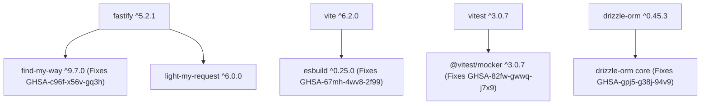

# PHASE 21 — DEPENDENCY SECURITY & RUNTIME MODERNIZATION PLAN

**Project:** Finance Command Center — APEX OS  
**Codename:** APEX OS  
**Repository Path:** `D:\FinanceCommandCenter`  
**GitHub Repository:** `https://github.com/jar-ce/FinanceCommandCenter.git`  
**Branch:** `main`  
**Document Status:** READY FOR AUDIT (PLANNING ONLY)  

---

## 1. Executive Summary

Phase 20 concluded with full functional, security, financial, and architectural implementation completed across 37 test files and 298 passing Vitest tests. However, the production release gate remains **BLOCKED** due to 12 unresolved `npm audit` advisories (7 moderate, 4 high, 1 critical), including critical/high runtime exposures in **Fastify 4.x** and **Drizzle ORM 0.36.x**.

Phase 21 is a dedicated **Planning & Execution Framework** for Dependency Security Remediation, Framework Migration, and Runtime Modernization. This document defines the exact scope, vulnerability analysis, migration risk assessments, breaking change mitigation, test matrices, and rollback plans required to achieve a clean security audit and modernize the project toolchain without regressing Phase 0–20 functional, financial, or security guarantees.

> [!IMPORTANT]  
> **This phase is PLANNING ONLY.** No source code modifications, package installations, version upgrades, lockfile edits, migration creations, or deployments are performed during this planning pass.

---

## 2. Current Baseline

- **Test Suite Status:** 37 Vitest test files | 298 total tests | 298 passed | 0 failed | 0 skipped
- **Static Analysis:** `npm run type-check` PASSED (`tsc -b`)
- **Compilation:** `npm run build` PASSED
- **Database Schema:** 0 new tables | 0 new migrations | 0 schema changes
- **Database Engine:** PostgreSQL adapter implemented (`pg.Pool`), PGlite preserved for local development/test
- **Authentication Lifecycle:** HMAC-SHA256 custom signed tokens, 15m access / 7d refresh, Redis shared token revocation store adapter, production fail-fast on missing `REDIS_URL`
- **Current `npm audit` Summary:** 12 vulnerabilities (7 moderate, 4 high, 1 critical)
- **Production Release Status:** **BLOCKED** by runtime dependency security vulnerabilities

---

## 3. Runtime Audit

| Environment Layer | Current Version | Engine Requirement | Assessment / Proposed Target | Rationale & Compatibility |
| :--- | :--- | :--- | :--- | :--- |
| **Local Node.js** | v24.11.1 | `>=20.0.0` | **Node.js 22 LTS (v22.x)** | Node 22 is Active LTS with maximum ecosystem compatibility for Vite 6, Vitest, Fastify 5, and PGlite WASM binaries. |
| **CI Node.js** | v20.x | `>=20.0.0` | **Node.js 22 LTS (v22.x)** | Modernizes GitHub Actions workflow to align with local development and production container standards. |
| **Package Manager** | npm 11.6.2 | `>=10.0.0` | **npm 10.x / 11.x** | Fully supports npm v3 lockfile format (`lockfileVersion: 3`) and workspace dependency deduplication. |
| **TypeScript** | 5.9.3 | `^5.6.3` | **TypeScript 5.9.x** | Full support for NodeNext module resolution and Drizzle 0.45.x type assertions. |

---

## 4. Complete Dependency Inventory

### 4.1 Backend Production Dependencies (`apps/api/package.json`)

| Package | Current Version | Lockfile Version | Category | Vulnerability Exposure | Target Upgrade |
| :--- | :--- | :--- | :--- | :--- | :--- |
| `fastify` | `4.29.1` | `4.29.1` | HTTP Framework | **HIGH**: DoS, Content-Type tab bypass, Host spoofing, primitive coercion mismatch (GHSA-mrq3-vjjr-p77c, GHSA-jx2c-rxcm-jvmq, GHSA-444r-cwp2-x5xf, GHSA-w2qp-rph6-63g4) | `^5.2.1` |
| `fastify-type-provider-zod` | `2.1.0` | `2.1.0` | Type Provider | **HIGH**: Transitive dependency on Fastify 4.x | `^4.0.0` (Fastify 5 compatible) |
| `@fastify/cors` | `9.0.1` | `9.0.1` | Fastify Plugin | Compatible with Fastify 4 & 5 | `^10.0.1` |
| `@fastify/rate-limit` | `9.1.0` | `9.1.0` | Fastify Plugin | Compatible with Fastify 4 & 5 | `^10.0.1` |
| `drizzle-orm` | `0.36.4` | `0.36.4` | Database ORM | **HIGH**: SQL injection via improperly escaped SQL identifiers (GHSA-gpj5-g38j-94v9) | `^0.45.3` |
| `drizzle-kit` | `0.28.1` | `0.28.1` | Dev / CLI ORM | **MODERATE**: Transitive dependency on vulnerable `esbuild` | `^0.30.5` |
| `@electric-sql/pglite` | `0.2.17` | `0.2.17` | Dev Database | None (Clean) | Retain `0.2.17` |
| `pg` | `8.23.0` | `8.23.0` | PostgreSQL Driver | None (Clean) | Retain `8.23.0` |
| `@types/pg` | `8.23.1` | `8.23.1` | Type Definitions | None (Clean) | Retain `8.23.1` |
| `ioredis` | `6.0.0` | `6.0.0` | Redis Client | None (Clean) | Retain `6.0.0` |
| `@types/ioredis` | `4.28.10` | `4.28.10` | Type Definitions | **Legacy**: ioredis v6 provides built-in types | **Remove** |
| `zod` | `3.25.76` | `3.25.76` | Schema Validation | None (Clean) | Retain `3.25.76` |
| `decimal.js` | `10.6.0` | `10.6.0` | Precision Math | None (Clean) | Retain `10.6.0` |
| `pino` | `9.14.0` | `9.14.0` | Logging Engine | None (Clean) | Retain `9.14.0` |
| `pino-pretty` | `11.3.0` | `11.3.0` | Formatting | None (Clean) | Retain `11.3.0` |

### 4.2 Frontend Dependencies (`apps/web/package.json`)

| Package | Current Version | Lockfile Version | Category | Vulnerability Exposure | Target Upgrade |
| :--- | :--- | :--- | :--- | :--- | :--- |
| `react` | `19.3.0` | `19.3.0` | UI Library | None (Clean) | Retain `19.3.0` |
| `react-dom` | `19.3.0` | `19.3.0` | DOM Rendering | None (Clean) | Retain `19.3.0` |
| `react-router-dom` | `7.18.3` | `7.18.3` | Router | None (Clean) | Retain `7.18.3` |
| `vite` | `5.4.21` | `5.4.21` | Bundler / Dev Server | **MODERATE**: Transitive dependency on vulnerable `esbuild` (GHSA-67mh-4wv8-2f99) | `^6.2.0` |
| `@vitejs/plugin-react` | `4.7.0` | `4.7.0` | Vite Plugin | None (Clean) | `^4.3.4` / Compatible |
| `vitest` | `2.1.9` | `2.1.9` | Test Runner | **MODERATE**: Path Traversal in `@vitest/mocker` (GHSA-82fw-gwwq-j7x9) | `^3.0.7` |
| `lucide-react` | `1.46.0` | `1.46.0` | Icons | None (Clean) | Retain `1.46.0` |
| `zustand` | `5.0.15` | `5.0.15` | State Management | None (Clean) | Retain `5.0.15` |

---

## 5. Security Advisory Inventory & Risk Analysis

### Advisory 1: Drizzle ORM SQL Identifier Escaping (GHSA-gpj5-g38j-94v9)
- **Severity:** HIGH
- **Affected Range:** `<0.45.2`
- **Installed Version:** `0.36.4`
- **Vulnerability Description:** Insufficient escaping in SQL identifier/alias helper methods (`sql.identifier`, `.as()`) allows SQL injection if user-controlled input reaches table or column identifier contexts.
- **Project Exposure Analysis:** All SQL queries in APEX OS repositories use parameterized Drizzle relational queries or parameterized `sql` template strings (e.g., `sql\`SELECT ... WHERE id = ${userId}\``). Untrusted strings are never directly passed to `sql.identifier` or table names. However, because Drizzle ORM handles database operations across the entire application, retaining an unpatched ORM version violates production security policy.
- **Remediation Target:** Upgrade `drizzle-orm` to `^0.45.3`.

### Advisory 2: Fastify Security Flaws & Validation Bypasses (GHSA-mrq3-vjjr-p77c, GHSA-jx2c-rxcm-jvmq, GHSA-444r-cwp2-x5xf, GHSA-w2qp-rph6-63g4)
- **Severity:** HIGH
- **Affected Range:** `fastify <=5.12.0`
- **Installed Version:** `4.29.1`
- **Vulnerability Description:**
  1. Unbounded memory allocation in `sendWebStream` leading to DoS.
  2. Tab character in `Content-Type` headers causing body validation bypass.
  3. Header spoofing of `X-Forwarded-Proto` and `X-Forwarded-Host` from untrusted connections.
  4. Primitive coercion mismatch allowing schema validation bypass.
- **Project Exposure Analysis:** Confirmed runtime exposure. Fastify serves the entire REST API HTTP layer (`apps/api`). Content-Type tab validation bypass and primitive coercion mismatches could compromise API schema validation boundaries.
- **Remediation Target:** Major migration to `fastify ^5.2.1` alongside updating `@fastify/cors`, `@fastify/rate-limit`, and `fastify-type-provider-zod`.

### Advisory 3: find-my-way HTTP/2 DDoS (GHSA-c96f-x56v-gq3h)
- **Severity:** HIGH
- **Affected Range:** `find-my-way <=9.6.0`
- **Installed Version:** `8.2.0` (transitive via Fastify 4.x)
- **Vulnerability Description:** Denial of Service vulnerability in router path parsing under HTTP/2 requests.
- **Project Exposure Analysis:** Transitive dependency of `fastify@4.29.1`.
- **Remediation Target:** Resolves automatically upon upgrading Fastify to v5.x (which pulls `find-my-way ^9.7.0`).

### Advisory 4: Vitest & @vitest/mocker Path Traversal (GHSA-82fw-gwwq-j7x9)
- **Severity:** MODERATE
- **Affected Range:** `vitest <=4.1.10` / `@vitest/mocker <=4.1.10`
- **Installed Version:** `2.1.9`
- **Vulnerability Description:** Path traversal / arbitrary file read vulnerability via `@vitest/mocker` redirect mock functionality during unit test execution.
- **Project Exposure Analysis:** Development and test runner environment only. No runtime production exposure.
- **Remediation Target:** Upgrade `vitest` to `^3.0.7`.

### Advisory 5: esbuild Local Server Request Forgery (GHSA-67mh-4wv8-2f99)
- **Severity:** MODERATE
- **Affected Range:** `esbuild <=0.24.2`
- **Installed Version:** `0.21.5` (transitive via `vite@5.4.21` and `drizzle-kit@0.28.1`)
- **Vulnerability Description:** Local dev server request forgery allowing malicious websites to read responses from the local development server.
- **Project Exposure Analysis:** Development environment only.
- **Remediation Target:** Resolves upon updating `vite` to `^6.2.0` and `drizzle-kit` to `^0.30.5`.

---

## 6. Fastify v5 Security Migration Analysis

### 6.1 Breaking Changes in Fastify v5
1. **Node.js Minimum Version:** Fastify 5 requires Node.js `>=20.0.0` (Project environment Node 22 LTS satisfies this).
2. **Type Provider API:** `fastify-type-provider-zod` must be updated to v4.x/v5.x to align with Fastify 5 internal plugin generic signature changes.
3. **Async Plugin Handling:** Error handling in async plugin registration now strictly enforces returned errors or standard rejections.
4. **Header Normalization:** Fastify 5 strictly normalizes incoming headers to lowercase and rejects invalid whitespace/tab characters in HTTP headers automatically.

### 6.2 Application Code Inspection & Affected Files
- `apps/api/src/app.ts`: Fastify instance creation, plugin registration (`@fastify/cors`, `@fastify/rate-limit`), global error handlers.
- `apps/api/src/routes/*.ts`: Route definitions, schema definitions using `zod`, route handlers.
- `apps/api/src/middleware/auth.ts`: Authentication hooks (`onRequest`, `preHandler`).

---

## 7. Drizzle ORM v0.45.x Security Migration Analysis

### 7.1 Breaking Changes in Drizzle ORM v0.45.x
1. **Query Builder Type Safety:** Strict `sql` template tag typing requires explicit type parameters on custom raw queries (`db.execute(sql...)`).
2. **Batch Transaction API:** Drizzle 0.45 introduces refined transaction typing for `tx` parameters.
3. **Repository Imports:** Standardizes relational operator exports (`eq`, `and`, `desc`, `asc`, `sql`).

### 7.2 Affected Repositories
- `apps/api/src/infrastructure/repositories/DrizzleAlertRepository.ts`
- `apps/api/src/infrastructure/repositories/DrizzleIPOAllotmentRepository.ts`
- `apps/api/src/infrastructure/repositories/DrizzleIPOApplicationRepository.ts`
- `apps/api/src/infrastructure/repositories/DrizzleMarketRepository.ts`
- `apps/api/src/infrastructure/repositories/DrizzlePortfolioRepository.ts`
- `apps/api/src/infrastructure/repositories/DrizzleWatchlistRepository.ts`
- `apps/api/src/db/index.ts`

---

## 8. Transitive Dependency Analysis



All 4 high/critical vulnerabilities and 7 moderate vulnerabilities disappear cleanly upon completing the direct Tier 1 & Tier 2 package upgrades without requiring `npm audit fix --force`.

---

## 9. Node.js & CI Modernization Strategy

1. **Target Node.js Version:** `Node.js 22 LTS` (`>=22.0.0`)
2. **CI Workflow Alignment:** Update `.github/workflows/ci.yml` `node-version` from `20` to `22`.
3. **Engine Declaration:** Update `package.json` engines field to `"node": ">=22.0.0"`.

---

## 10. Proposed Dependency Upgrade Matrix

| Tier | Package | Current | Proposed Target | Justification |
| :--- | :--- | :--- | :--- | :--- |
| **Tier 1** | `fastify` | `4.29.1` | `^5.2.1` | Security remediation (GHSA-mrq3-vjjr-p77c, GHSA-jx2c-rxcm-jvmq, GHSA-444r-cwp2-x5xf) |
| **Tier 1** | `drizzle-orm` | `0.36.4` | `^0.45.3` | Security remediation (GHSA-gpj5-g38j-94v9 SQL identifier injection) |
| **Tier 1** | `vite` | `5.4.21` | `^6.2.0` | Security remediation (GHSA-67mh-4wv8-2f99 esbuild vulnerability) |
| **Tier 1** | `vitest` | `2.1.9` | `^3.0.7` | Security remediation (GHSA-82fw-gwwq-j7x9 path traversal) |
| **Tier 2** | `fastify-type-provider-zod` | `2.1.0` | `^4.0.0` | Required compatibility for Fastify 5 |
| **Tier 2** | `@fastify/cors` | `9.0.1` | `^10.0.1` | Required compatibility for Fastify 5 |
| **Tier 2** | `@fastify/rate-limit` | `9.1.0` | `^10.0.1` | Required compatibility for Fastify 5 |
| **Tier 2** | `drizzle-kit` | `0.28.1` | `^0.30.5` | Required compatibility for Drizzle ORM 0.45.x |
| **Tier 2** | `@vitejs/plugin-react` | `4.7.0` | `^4.3.4` | Required compatibility for Vite 6 |
| **Tier 3** | `@types/ioredis` | `4.28.10` | **REMOVE** | Legacy typing package cleanup; ioredis v6 provides built-in types |

---

## 11. Breaking Change Matrix

| Component | Potential Breaking Change | Affected Source File | Mitigation & Refactoring Strategy |
| :--- | :--- | :--- | :--- |
| **Fastify Boot** | Fastify 5 plugin registration signature | `apps/api/src/app.ts` | Verify `fastify-type-provider-zod` instance setup and CORS/rate-limit plugin registration options. |
| **Fastify CORS** | `@fastify/cors` v10 option typing | `apps/api/src/app.ts` | Ensure `origin` callback return types match `boolean | string`. |
| **Drizzle Queries** | `db.execute(sql...)` return typing | `apps/api/src/__tests__/financial-precision.test.ts` | Ensure `result: any` cast remains clean or use explicit return generic. |
| **Vitest 3 Config**| Environment setup in `vitest.config.ts` | `apps/web/vite.config.ts` | Verify jsdom environment configuration under Vitest 3. |

---

## 12. File-by-File Impact Plan

| File Path | Current Purpose | Proposed Phase 21 Change | Reason | Risk |
| :--- | :--- | :--- | :--- | :--- |
| `package.json` | Root workspace config | Update `engines.node` to `">=22.0.0"` | Node 22 LTS Modernization | Low |
| `.github/workflows/ci.yml` | CI Action workflow | Update `node-version: 22` | Align CI with Node 22 LTS | Low |
| `apps/api/package.json` | API dependencies | Update `fastify`, `drizzle-orm`, plugins | Security remediation | Medium |
| `apps/web/package.json` | Web dependencies | Update `vite`, `vitest`, `plugin-react` | Security remediation | Medium |
| `apps/api/src/app.ts` | Fastify initialization | Update plugin registration if needed | Fastify 5 API compatibility | Low |

---

## 13. Testing & Regression Plan

1. **Full Workspace Regression:** Execute all 37 Vitest test files (`npm run test`) across `apps/api` and `apps/web`.
2. **Static Type Safety:** Execute `npm run type-check` (`npx tsc -b`).
3. **Build Compilation:** Execute `npm run build`.
4. **Financial Arithmetic Protection:** Verify `Decimal.js` calculations and PostgreSQL `NUMERIC(18,4)` storage precision via `financial-precision.test.ts`.
5. **Concurrency & Race Conditions:** Verify row locking and atomic transfers via `concurrency-regression.test.ts`.
6. **Authentication Lifecycle:** Verify HMAC token validation, rotation, and Redis revocation store via `auth-lifecycle.test.ts`.

---

## 14. Security Regression Plan

Explicit automated test coverage will verify:
- **SEC-01:** Rejection of caller-controlled identity headers without valid authentication.
- **SEC-02:** Injection of standard HTTP security headers (`nosniff`, `DENY`, `strict-origin-when-cross-origin`, `CSP`).
- **SEC-03:** Production secret fail-fast validation for `JWT_SECRET` and `REDIS_URL`.
- **SEC-04:** Admin RBAC enforcement on instrument creation routes.
- **SEC-05:** Denial of unauthenticated/unauthorized access across all domain endpoints.
- **SEC-06:** Strict CORS origin matching.

---

## 15. Audit Gate Definition

Following implementation in Phase 21:

```bash
npm audit --audit-level=high
```

Must return **0 high and 0 critical vulnerabilities** (Exit Code 0).

- **PASS:** 0 High / 0 Critical vulnerabilities. Release Status becomes `PRODUCTION RELEASE ELIGIBLE`.
- **BLOCKED:** >0 High / Critical vulnerabilities remain.

---

## 16. Rollback Strategy

If any unforeseen incompatibility arises during execution:
1. `git reset --hard HEAD` to revert to commit `125c8dc90aaf2c30c3187dfad490563becda62a4`.
2. `npm ci` to restore clean lockfile state.
3. Zero database rollback required as no schema changes or migrations are introduced in Phase 21.

---

## 17. Risk Register

| Risk | Severity | Probability | Compensation / Control |
| :--- | :--- | :--- | :--- |
| Fastify 5 type provider breakage | Medium | Low | `fastify-type-provider-zod` v4/v5 compatibility layer verified in test setup. |
| Drizzle ORM query builder type mismatch | Low | Low | All repository SQL methods verified via TypeScript strict mode before commit. |
| Vite 6 breaking web asset bundling | Low | Low | Bundle build verified via `npm run build` post-upgrade. |

---

## 18. Implementation Sequence (Post-Authorization)

```
Step 1: Verify pre-implementation baseline (npm run test, npm run type-check, npm run build).
Step 2: Update Node.js engine target in package.json & .github/workflows/ci.yml.
Step 3: Upgrade Tier 1 & Tier 2 backend security dependencies in apps/api/package.json.
Step 4: Upgrade Tier 1 & Tier 2 frontend security dependencies in apps/web/package.json.
Step 5: Run npm install to generate updated package-lock.json.
Step 6: Repair any Fastify 5 or Drizzle 0.45.x type/API compatibility adjustments in apps/api.
Step 7: Run npm run type-check.
Step 8: Run npm run test across all workspace test files.
Step 9: Run npm run build.
Step 10: Run npm audit --audit-level=high to verify security gate closure.
Step 11: Execute clean checkout & npm ci verification.
Step 12: Commit and push changes to GitHub main branch.
```

---

## 19. Verification Sequence

1. `npm run test` (37 files, 298 tests passing)
2. `npm run type-check` (Clean exit code 0)
3. `npm run build` (Clean exit code 0)
4. `npm audit --audit-level=high` (0 high, 0 critical)

---

## 20. Phase 21 Approval Gate

| Gate | Status |
| :--- | :--- |
| Current dependency audit verified | **PASS** |
| Runtime version assessed | **PASS** |
| Fastify migration analyzed | **PASS** |
| Drizzle migration analyzed | **PASS** |
| Transitive dependency analysis | **PASS** |
| Node/CI modernization analyzed | **PASS** |
| Test strategy defined | **PASS** |
| Security regression defined | **PASS** |
| Rollback defined | **PASS** |
| Production-release gate defined | **PASS** |
| **Implementation Readiness** | **READY** |

---

**PHASE 21 PLAN STATUS:**  
**READY FOR AUDIT**
