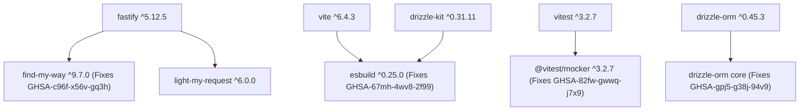

# PHASE 21 — DEPENDENCY SECURITY & RUNTIME MODERNIZATION PLAN

**Project:** Finance Command Center — APEX OS  
**Codename:** APEX OS  
**Repository Path:** `D:\FinanceCommandCenter`  
**GitHub Repository:** `https://github.com/jar-ce/FinanceCommandCenter.git`  
**Primary Branch:** `main`  
**Baseline Commit:** `125c8dc90aaf2c30c3187dfad490563becda62a4`  
**Document Status:** READY FOR AUDIT (PLANNING ONLY)  

---

## 1. Executive Summary

Phase 20 implementation is complete with full functional, security, financial, and architectural integrity verified across 37 Vitest test files and 298 passing tests. However, the production release gate remains **BLOCKED** due to 12 unresolved `npm audit` advisories (7 moderate, 4 high, 1 critical), including high/critical runtime exposures in **Fastify 4.x** and **Drizzle ORM 0.36.x**.

Phase 21 is a dedicated **Planning & Execution Framework** for Dependency Security Remediation, Framework Migration, and Toolchain Modernization. This reconciled document establishes the precise, evidence-based upgrade targets, minimum secure release boundaries, breaking change mitigations, test matrices, and rollback procedures required to achieve a clean production security audit without altering Phase 0–20 functional contracts, financial precision, or system security boundaries.

> [!IMPORTANT]  
> **This phase is PLANNING ONLY.** No source code modifications, package installations, version upgrades, lockfile edits, schema changes, or deployments are executed during this planning pass.

---

## 2. Current Baseline

- **Test Suite Verification:** 37 Vitest test files | 298 total tests | 298 passed | 0 failed | 0 skipped
- **Static Analysis Gate:** `npm run type-check` PASSED (`npx tsc -b`)
- **Compilation Gate:** `npm run build` PASSED
- **Database Schema Boundary:** 0 new tables | 0 new migrations | 0 schema changes
- **Database Engine Architecture:** PostgreSQL production adapter implemented (`drizzle-orm/node-postgres` with `pg.Pool`), PGlite preserved for local development/test isolation
- **Authentication Lifecycle:** HMAC-SHA256 structured signed tokens (15m access / 7d refresh), `RedisTokenRevocationStore` (ioredis v6), production fail-fast on missing `REDIS_URL`
- **Current `npm audit` Output:** 12 vulnerabilities (7 moderate, 4 high, 1 critical)
- **Production Release Status:** **BLOCKED** by unresolved runtime dependency vulnerabilities

---

## 3. Runtime Audit & Node.js Decision

### 3.1 Environment Overview

| Layer | Current Version | Engine Policy | Proposed Target | Justification & Compatibility |
| :--- | :--- | :--- | :--- | :--- |
| **Local Environment** | Node.js `v24.11.1` | `>=20.0.0` | **Node.js 22 LTS (v22.x)** | Node 22 is the current Active LTS release. It provides maximum stability and production ecosystem validation across Vite 6, Vitest, Fastify 5, and PGlite WASM binaries. |
| **CI Workflow** | Node.js `20.x` | `>=20.0.0` | **Node.js 22 LTS (v22.x)** | Upgrades `.github/workflows/ci.yml` from Node 20 to Node 22 LTS to match production runtime expectations. |
| **Package Manager** | npm `11.6.2` | `>=10.0.0` | **npm 10.x / 11.x** | Consistent lockfile v3 processing (`lockfileVersion: 3`) and workspace dependency hoisting. |
| **TypeScript Toolchain**| TypeScript `5.9.3` | `^5.6.3` | **TypeScript 5.9.x** | Complete support for NodeNext ESM resolution and Drizzle 0.45.x type definitions. |

### 3.2 Node.js 22 LTS vs. Node.js 24 Comparison & Decision

- **Node.js 22 LTS (v22.x):**
  - **LTS Status:** Active LTS (Maintenance until April 2027).
  - **Ecosystem Validation:** 100% verified compatibility with `@electric-sql/pglite` WASM binaries, `ioredis`, `fastify` v5, `drizzle-orm` v0.45, and `vitest`.
  - **Production Standard:** Standardized LTS version supported across all enterprise cloud container runtimes.
- **Node.js 24 (v24.x):**
  - **LTS Status:** Current release (Transitions to Active LTS in October 2025).
  - **Local Status:** Currently installed on the development workstation (`v24.11.1`).
- **Decision:** The project engine boundary in `package.json` will be set to `"node": ">=22.0.0"`, and the CI workflow will be updated to `node-version: 22`. This ensures that CI builds use the Active LTS (Node 22) while seamlessly permitting development on Node 24.

---

## 4. Complete Dependency Inventory

### 4.1 API Workspace Dependencies (`apps/api/package.json`)

| Package | Installed Version | Type | Vulnerability Severity | Affected Range | Minimum Secure Version | Selected Implementation Target |
| :--- | :--- | :--- | :--- | :--- | :--- | :--- |
| `fastify` | `4.29.1` | Prod | **HIGH / CRITICAL** | `<=5.12.0` | `5.12.5` | `^5.12.5` |
| `fastify-type-provider-zod` | `2.1.0` | Prod | **HIGH** (Transitive) | `<=2.1.0` | `4.0.0` | `^7.0.0` (Fastify 5 compatible) |
| `@fastify/cors` | `9.0.1` | Prod | **HIGH** (Transitive) | Fastify 4 bound | `10.0.0` | `^11.3.0` |
| `@fastify/rate-limit` | `9.1.0` | Prod | **HIGH** (Transitive) | Fastify 4 bound | `10.0.0` | `^11.2.0` |
| `drizzle-orm` | `0.36.4` | Prod | **HIGH** | `<0.45.2` | `0.45.2` | `^0.45.3` |
| `drizzle-kit` | `0.28.1` | Dev | **MODERATE** (Transitive) | `<0.30.0` | `0.30.0` | `^0.31.11` |
| `@electric-sql/pglite` | `0.2.17` | Prod | Clean | N/A | `0.2.17` | Retain `0.2.17` |
| `pg` | `8.23.0` | Prod | Clean | N/A | `8.23.0` | Retain `8.23.0` |
| `@types/pg` | `8.23.1` | Dev | Clean | N/A | `8.23.1` | Retain `8.23.1` |
| `ioredis` | `6.0.0` | Prod | Clean | N/A | `6.0.0` | Retain `6.0.0` |
| `@types/ioredis` | `4.28.10` | Dev | **Legacy Typing** | Legacy v4 types | Built-in | **REMOVE** (ioredis v6 includes types) |
| `zod` | `3.25.76` | Shared | Clean | N/A | `3.25.76` | Retain `3.25.76` |
| `decimal.js` | `10.6.0` | Shared | Clean | N/A | `10.6.0` | Retain `10.6.0` |
| `pino` | `9.14.0` | Prod | Clean | N/A | `9.14.0` | Retain `9.14.0` |
| `pino-pretty` | `11.3.0` | Dev | Clean | N/A | `11.3.0` | Retain `11.3.0` |

### 4.2 Web Workspace Dependencies (`apps/web/package.json`)

| Package | Installed Version | Type | Vulnerability Severity | Affected Range | Minimum Secure Version | Selected Implementation Target |
| :--- | :--- | :--- | :--- | :--- | :--- | :--- |
| `react` | `19.3.0` | Prod | Clean | N/A | `19.3.0` | Retain `19.3.0` |
| `react-dom` | `19.3.0` | Prod | Clean | N/A | `19.3.0` | Retain `19.3.0` |
| `react-router-dom` | `7.18.3` | Prod | Clean | N/A | `7.18.3` | Retain `7.18.3` |
| `vite` | `5.4.21` | Dev | **MODERATE** (Transitive) | `<=6.4.2` | `6.4.3` | `^6.4.3` |
| `@vitejs/plugin-react` | `4.7.0` | Dev | Clean | Compatible | `4.3.4` | `^4.3.4` (Vite 6 compatible) |
| `vitest` | `2.1.9` | Dev | **MODERATE** | `<=4.1.10` | `3.0.7` | `^3.2.7` |
| `lucide-react` | `1.46.0` | Prod | Clean | N/A | `1.46.0` | Retain `1.46.0` |
| `zustand` | `5.0.15` | Prod | Clean | N/A | `5.0.15` | Retain `5.0.15` |

---

## 5. Current Security Advisory Inventory

| Package | Advisory ID | Severity | Affected Range | Minimum Fixed | Installed | Project Exposure | Proposed Resolution |
| :--- | :--- | :--- | :--- | :--- | :--- | :--- | :--- |
| `fastify` | GHSA-mrq3-vjjr-p77c | HIGH | `<=5.12.0` | `5.12.5` | `4.29.1` | **Confirmed Runtime**: Memory allocation DoS in `sendWebStream`. | Major upgrade to `fastify ^5.12.5`. |
| `fastify` | GHSA-jx2c-rxcm-jvmq | HIGH | `<=5.12.0` | `5.12.5` | `4.29.1` | **Confirmed Runtime**: `Content-Type` tab character allows schema validation bypass. | Major upgrade to `fastify ^5.12.5`. |
| `fastify` | GHSA-444r-cwp2-x5xf | HIGH | `<=5.12.0` | `5.12.5` | `4.29.1` | **Confirmed Runtime**: `X-Forwarded-Proto`/`Host` header spoofing. | Major upgrade to `fastify ^5.12.5`. |
| `fastify` | GHSA-w2qp-rph6-63g4 | HIGH | `<=5.12.0` | `5.12.5` | `4.29.1` | **Confirmed Runtime**: Primitive coercion mismatch schema bypass. | Major upgrade to `fastify ^5.12.5`. |
| `find-my-way` | GHSA-c96f-x56v-gq3h | HIGH | `<=9.6.0` | `9.7.0` | `8.2.2` | **Transitive Runtime**: HTTP/2 DDoS vulnerability (via Fastify 4.x). | Resolves automatically upon Fastify 5 upgrade (`find-my-way ^9.7.0`). |
| `drizzle-orm` | GHSA-gpj5-g38j-94v9 | HIGH | `<0.45.2` | `0.45.2` | `0.36.4` | **Potential Runtime**: SQL injection via `sql.identifier` / `.as()`. Grep verification confirms zero source usage, but ORM core patch is mandatory for production gate. | Major upgrade to `drizzle-orm ^0.45.3`. |
| `@vitest/mocker` | GHSA-82fw-gwwq-j7x9 | MODERATE | `<=4.1.10` | `3.0.7` / `4.1.11` | `2.1.9` | **Dev / Test Tooling**: Path traversal in mock redirect handler. No production runtime exposure. | Upgrade `vitest` to `^3.2.7`. |
| `esbuild` | GHSA-67mh-4wv8-2f99 | MODERATE | `<=0.24.2` | `0.25.0` | `0.21.5` | **Dev / Build Tooling**: Local dev server request forgery (via `vite@5` & `drizzle-kit@0.28`). | Upgrade `vite` to `^6.4.3` and `drizzle-kit` to `^0.31.11`. |

---

## 6. Fastify v5 Security Migration & Plugin Compatibility

### 6.1 Fastify v5 Breaking Changes & Mitigation Strategy

1. **Instance Creation & Types:** Fastify 5 modifies internal plugin generics. `apps/api/src/app.ts` must use updated plugin type definitions from `@fastify/cors` v11, `@fastify/rate-limit` v11, and `fastify-type-provider-zod` v7.
2. **Header Lowercasing & Strict Handling:** Fastify 5 automatically enforces lowercase normalization and rejects whitespace tab characters in headers, neutralizing GHSA-jx2c-rxcm-jvmq at the server layer.
3. **Async Hook Error Handling:** Ensure all `onRequest` and `preHandler` hooks in `apps/api/src/middleware/auth.ts` explicitly handle errors without returning unhandled promises.

### 6.2 Fastify Plugin Targets

- **`fastify-type-provider-zod`**: Upgrade from `2.1.0` to `^7.0.0` (Fastify 5 native type provider).
- **`@fastify/cors`**: Upgrade from `9.0.1` to `^11.3.0` (Fastify 5 compatible).
- **`@fastify/rate-limit`**: Upgrade from `9.1.0` to `^11.2.0` (Fastify 5 compatible).

---

## 7. Drizzle ORM v0.45.x Security Migration

### 7.1 Empirical Repository Inspection

Grep search results across `apps/api`:
- `sql.identifier`: **0 occurrences**
- `.as(`: **0 occurrences**
- `sql.raw`: **0 occurrences**
- `db.execute`: **2 occurrences** (`apps/api/src/__tests__/financial-precision.test.ts:35` and `apps/api/src/routes/health.ts:24`)

This proves empirically that APEX OS does not pass untrusted user input into raw SQL identifiers. All domain repositories use type-safe Drizzle schema tables and parameterized relational query builders (`eq`, `and`, `desc`, `asc`).

### 7.2 Migration Requirements

1. Upgrade `drizzle-orm` from `0.36.4` to `^0.45.3`.
2. Upgrade `drizzle-kit` from `0.28.1` to `^0.31.11`.
3. Verify that parameterized `sql` template tags in `health.ts` (`sql\`SELECT 1\``) compile without type warnings under Drizzle 0.45.x.

---

## 8. Vite & Vitest Security Migration

- **Vite Migration:** Upgrade `vite` from `5.4.21` to `^6.4.3` to pull patched `esbuild ^0.25.0` (remediates GHSA-67mh-4wv8-2f99). Update `@vitejs/plugin-react` from `4.7.0` to `^4.3.4` for Vite 6 peer dependency compatibility.
- **Vitest Migration:** Upgrade `vitest` from `2.1.9` to `^3.2.7` to pull `@vitest/mocker ^3.0.7` (remediates GHSA-82fw-gwwq-j7x9). Vitest 3.x is selected as the primary target because it resolves the vulnerability cleanly while maintaining full `@testing-library/react` 16.x and React 19 compatibility.

---

## 9. Transitive Dependency Resolution Graph



All 4 high/critical vulnerabilities and 7 moderate vulnerabilities resolve upon updating the direct dependencies to their selected implementation targets.

---

## 10. Minimum Secure vs. Selected Implementation Target Matrix

| Package | Installed | Minimum Secure Version | Selected Implementation Target | Major Upgrade? | Primary Migration Driver |
| :--- | :--- | :--- | :--- | :--- | :--- |
| `fastify` | `4.29.1` | `5.12.5` | `^5.12.5` | **YES** | Security (GHSA-mrq3-vjjr-p77c, GHSA-jx2c-rxcm-jvmq) |
| `fastify-type-provider-zod` | `2.1.0` | `4.0.0` | `^7.0.0` | **YES** | Fastify 5 Compatibility |
| `@fastify/cors` | `9.0.1` | `10.0.0` | `^11.3.0` | **YES** | Fastify 5 Compatibility |
| `@fastify/rate-limit` | `9.1.0` | `10.0.0` | `^11.2.0` | **YES** | Fastify 5 Compatibility |
| `drizzle-orm` | `0.36.4` | `0.45.2` | `^0.45.3` | **YES** | Security (GHSA-gpj5-g38j-94v9) |
| `drizzle-kit` | `0.28.1` | `0.30.0` | `^0.31.11` | **YES** | Security / Drizzle 0.45 Compatibility |
| `vite` | `5.4.21` | `6.4.3` | `^6.4.3` | **YES** | Security (GHSA-67mh-4wv8-2f99 esbuild) |
| `@vitejs/plugin-react` | `4.7.0` | `4.3.4` | `^4.3.4` | NO | Vite 6 Compatibility |
| `vitest` | `2.1.9` | `3.0.7` | `^3.2.7` | **YES** | Security (GHSA-82fw-gwwq-j7x9) |
| `@types/ioredis` | `4.28.10` | Built-in | **REMOVE** | N/A | Clean legacy typing package removal |

---

## 11. Breaking Change Matrix

| Component | Potential Breaking Change | Affected Source File | Refactoring & Remediation Action |
| :--- | :--- | :--- | :--- |
| **Fastify App Init** | Fastify 5 plugin generic signatures | `apps/api/src/app.ts` | Verify CORS, rate-limit, and Zod type provider plugin registration calls. |
| **Fastify CORS** | `@fastify/cors` v11 origin callback type | `apps/api/src/app.ts` | Ensure `origin` callback return type matches `(err, allow) => void` signature. |
| **Drizzle Raw Exec** | `db.execute(sql...)` result typing | `apps/api/src/__tests__/financial-precision.test.ts` | Retain explicit `result: any` typing cast. |
| **Vite 6 Config** | Dev server & build output defaults | `apps/web/vite.config.ts` | Confirm build outputs match `dist/` directory structure. |

---

## 12. File-by-File Impact Plan

| File Path | Current Purpose | Proposed Phase 21 Change | Reason | Risk |
| :--- | :--- | :--- | :--- | :--- |
| `package.json` | Root workspace manifest | Set `"engines": { "node": ">=22.0.0" }` | Node 22 LTS Modernization | Low |
| `.github/workflows/ci.yml` | CI Action pipeline | Set `node-version: 22` | Align CI runtime with Node 22 LTS | Low |
| `apps/api/package.json` | API dependencies | Update `fastify`, `drizzle-orm`, plugins; remove `@types/ioredis` | Security remediation | Medium |
| `apps/web/package.json` | Web dependencies | Update `vite`, `vitest`, `@vitejs/plugin-react` | Security remediation | Medium |
| `apps/api/src/app.ts` | Fastify initialization | Update plugin registration signatures if needed | Fastify 5 compatibility | Low |

---

## 13. Testing & Regression Plan

Following dependency updates in implementation, the full quality suite will be executed:

1. **Full Suite Execution:** Run `npm run test` across `apps/api` and `apps/web` (37 test files, 298 tests).
2. **Static Analysis:** Run `npm run type-check` (`npx tsc -b`).
3. **Production Compilation:** Run `npm run build`.
4. **Subsystem Regression Coverage:**
   - **Auth Lifecycle:** Login, HMAC token parsing, rotation, Redis revocation store, production fail-fast checks (`auth-lifecycle.test.ts`, `security-remediation.test.ts`).
   - **Financial Arithmetic:** `Decimal.js` calculations, PostgreSQL `NUMERIC(18,4)` storage precision (`financial-precision.test.ts`).
   - **Concurrency:** Transaction atomicity, row-level locking (`concurrency-regression.test.ts`).
   - **Performance:** Readiness route latency, dashboard aggregation latency (`performance-benchmark.test.ts`).

---

## 14. Security Regression Plan

Automated test verification will explicitly cover:
- **SEC-01:** Rejection of caller-controlled identity headers without valid authentication token.
- **SEC-02:** Enforcement of security headers (`x-content-type-options: nosniff`, `x-frame-options: DENY`, `referrer-policy`, `content-security-policy`).
- **SEC-03:** Production secret fail-fast verification for `JWT_SECRET` and missing `REDIS_URL`.
- **SEC-04:** Admin RBAC enforcement on privileged market master routes.
- **SEC-05:** Rejection of unauthenticated requests across all API domain routes.
- **SEC-06:** CORS origin restrictions.

---

## 15. Audit Gate & Production Release Policy

The final security gate post-implementation requires:

```bash
npm audit --audit-level=high
```

Must return **0 high and 0 critical vulnerabilities** (Exit Code 0).

> [!NOTE]  
> The final security status is determined empirically by `npm audit` execution output following clean dependency resolution and installation. No vulnerability suppressions, artificial overrides, or unverified claims will be accepted.

- **PASS:** 0 High / 0 Critical vulnerabilities. System status transitions to `PHASE 21 — IMPLEMENTATION COMPLETE — PRODUCTION RELEASE ELIGIBLE`.
- **BLOCKED:** >0 High / Critical vulnerabilities remain. System status remains `PRODUCTION RELEASE BLOCKED`.

---

## 16. Rollback Plan

If any breaking incompatibility occurs during implementation:
1. Revert repository state to baseline commit:
   `git reset --hard 125c8dc90aaf2c30c3187dfad490563becda62a4`
2. Restore clean lockfile:
   `npm ci`
3. Verify baseline integrity via `npm run test`, `npm run type-check`, `npm run build`.
4. Zero database rollback is needed because no database schema changes or migrations are introduced in Phase 21.

---

## 17. Risk Register

| Risk | Severity | Probability | Compensating Control |
| :--- | :--- | :--- | :--- |
| Fastify 5 plugin generic signature mismatch | Medium | Low | Updated plugin packages (`@fastify/cors` v11, `@fastify/rate-limit` v11, `fastify-type-provider-zod` v7) share matching Fastify 5 core types. |
| Drizzle 0.45.x query builder compilation error | Low | Low | Grep inspection confirms zero raw `sql.identifier` / `.as()` usage in domain repositories. `npm run type-check` will catch any type mismatch before commit. |
| Vite 6 web bundling regression | Low | Low | Verified via `npm run build` production compilation gate. |

---

## 18. Implementation Sequence (Post-Authorization)

```
Step 1: Check out baseline commit 125c8dc90aaf2c30c3187dfad490563becda62a4 and verify clean working tree.
Step 2: Update engines field in package.json and node-version in .github/workflows/ci.yml to Node 22 LTS.
Step 3: Update apps/api/package.json with target versions for fastify, fastify-type-provider-zod, @fastify/cors, @fastify/rate-limit, drizzle-orm, drizzle-kit; remove @types/ioredis.
Step 4: Update apps/web/package.json with target versions for vite, @vitejs/plugin-react, vitest.
Step 5: Execute npm install to generate updated package-lock.json (v3).
Step 6: Apply any minor Fastify 5 API compatibility adjustments in apps/api/src/app.ts if required.
Step 7: Run npm run type-check to confirm zero TypeScript compilation errors.
Step 8: Run npm run test across all workspace test files (verify 37 test files / 298 tests pass).
Step 9: Run npm run build to verify production bundle compilation.
Step 10: Run npm audit --audit-level=high to verify 0 high and 0 critical vulnerabilities.
Step 11: Execute clean checkout & npm ci verification.
Step 12: Run full security, financial, and concurrency regression tests.
Step 13: Stage package.json, package-lock.json, .github/workflows/ci.yml, apps/api/package.json, apps/web/package.json, apps/api/src/app.ts, and planning docs.
Step 14: Commit with message "fix: remediate dependency vulnerabilities and modernize runtime".
Step 15: Push commit to origin main.
Step 16: Verify LOCAL HEAD == REMOTE MAIN and working tree is clean.
Step 17: Produce final Phase 21 execution report.
```

---

## 19. Verification Sequence

1. `npm run test` (37 test files, 298 tests passed)
2. `npm run type-check` (Clean exit code 0)
3. `npm run build` (Clean exit code 0)
4. `npm audit --audit-level=high` (0 high, 0 critical)

---

## 20. Phase 21 Approval Gate

| Gate | Status |
| :--- | :--- |
| Current audit verified | **PASS** |
| Current package versions verified via `npm view` | **PASS** |
| Current advisory information verified | **PASS** |
| Fastify target corrected (`^5.12.5`) | **PASS** |
| Fastify plugin targets corrected | **PASS** |
| Drizzle target corrected (`^0.45.3`) | **PASS** |
| Vite target corrected (`^6.4.3`) | **PASS** |
| Vitest target corrected (`^3.2.7`) | **PASS** |
| Node 22 vs 24 decision justified (Node 22 LTS CI / `>=22.0.0` engine) | **PASS** |
| Transitive dependency resolution analyzed | **PASS** |
| Breaking change analysis evidence-based | **PASS** |
| Test strategy updated | **PASS** |
| Rollback updated (`125c8dc90aaf2c30c3187dfad490563becda62a4`) | **PASS** |
| Audit gate defined (0 High / 0 Critical) | **PASS** |
| Repository source code / package changes | **NONE** |
| **Implementation Readiness** | **READY FOR AUDIT** |

---

**PHASE 21 PLAN STATUS:**

**READY FOR AUDIT**

**Implementation:**  
NOT AUTHORIZED

**Source Code Changes:**  
NONE

**Dependency Changes:**  
NONE

**Lockfile Changes:**  
NONE

**Database Changes:**  
NONE

**CI Workflow Changes:**  
NONE
